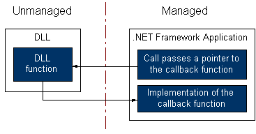

# Callback Functions
A callback function is code within a managed application that helps an unmanaged DLL function complete a task. Calls to a callback function pass indirectly from a managed application, through a DLL function, and back to the managed implementation. Some of the many DLL functions called with platform invoke require a callback function in managed code to run properly.  
  
 To call most DLL functions from managed code, you create a managed definition of the function and then call it. The process is straightforward.  
  
 Using a DLL function that requires a callback function has some additional steps. First, you must determine whether the function requires a callback by looking at the documentation for the function. Next, you have to create the callback function in your managed application. Finally, you call the DLL function, passing a pointer to the callback function as an argument. The following illustration summarizes these steps.  
  
   
Callback function and implementation  
  
 Callback functions are ideal for use in situations in which a task is performed repeatedly. Another common usage is with enumeration functions, such as **EnumFontFamilies**, **EnumPrinters**, and **EnumWindows** in the Win32 API. The **EnumWindows** function enumerates through all existing windows on your computer, calling the callback function to perform a task on each window. For instructions and an example, see [How to: Implement Callback Functions](../../../docs/framework/interop/how-to-implement-callback-functions.md).  
  
## See Also  
 [How to: Implement Callback Functions](../../../docs/framework/interop/how-to-implement-callback-functions.md)   
 [Calling a DLL Function](../../../docs/framework/interop/calling-a-dll-function.md)