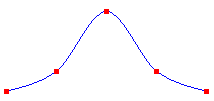
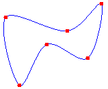

# How to: Draw Cardinal Splines
A cardinal spline is a curve that passes smoothly through a given set of points. To draw a cardinal spline, create a <xref:System.Drawing.Graphics> object and pass the address of an array of points to the <xref:System.Drawing.Graphics.DrawCurve%2A> method.  
  
### Drawing a Bell-Shaped Cardinal Spline  
  
-   The following example draws a bell-shaped cardinal spline that passes through five designated points. The following illustration shows the curve and five points.  
  
       
  
 [!code-csharp[System.Drawing.ConstructingDrawingCurves#21](../../../../samples/snippets/csharp/VS_Snippets_Winforms/System.Drawing.ConstructingDrawingCurves/CS/Class1.cs#21)]
 [!code-vb[System.Drawing.ConstructingDrawingCurves#21](../../../../samples/snippets/visualbasic/VS_Snippets_Winforms/System.Drawing.ConstructingDrawingCurves/VB/Class1.vb#21)]  
  
### Drawing a Closed Cardinal Spline  
  
-   Use the <xref:System.Drawing.Graphics.DrawClosedCurve%2A> method of the <xref:System.Drawing.Graphics> class to draw a closed cardinal spline. In a closed cardinal spline, the curve continues through the last point in the array and connects with the first point in the array. The following example draws a closed cardinal spline that passes through six designated points. The following illustration shows the closed spline along with the six points.  
  
   
  
 [!code-csharp[System.Drawing.ConstructingDrawingCurves#22](../../../../samples/snippets/csharp/VS_Snippets_Winforms/System.Drawing.ConstructingDrawingCurves/CS/Class1.cs#22)]
 [!code-vb[System.Drawing.ConstructingDrawingCurves#22](../../../../samples/snippets/visualbasic/VS_Snippets_Winforms/System.Drawing.ConstructingDrawingCurves/VB/Class1.vb#22)]  
  
### Changing the Bend of a Cardinal Spline  
  
-   Change the way a cardinal spline bends by passing a tension argument to the <xref:System.Drawing.Graphics.DrawCurve%2A> method. The following example draws three cardinal splines that pass through the same set of points. The following illustration shows the three splines along with their tension values. Note that when the tension is 0, the points are connected by straight lines.  
  
   
  
 [!code-csharp[System.Drawing.ConstructingDrawingCurves#23](../../../../samples/snippets/csharp/VS_Snippets_Winforms/System.Drawing.ConstructingDrawingCurves/CS/Class1.cs#23)]
 [!code-vb[System.Drawing.ConstructingDrawingCurves#23](../../../../samples/snippets/visualbasic/VS_Snippets_Winforms/System.Drawing.ConstructingDrawingCurves/VB/Class1.vb#23)]  
  
## Compiling the Code  
 The preceding examples are designed for use with Windows Forms, and they require <xref:System.Windows.Forms.PaintEventArgs> `e`, which is a parameter of the <xref:System.Windows.Forms.Control.Paint> event handler.  
  
## See Also  
 [Lines, Curves, and Shapes](../../../../docs/framework/winforms/advanced/lines-curves-and-shapes.md)   
 [Constructing and Drawing Curves](../../../../docs/framework/winforms/advanced/constructing-and-drawing-curves.md)