# Navigation Overview
[!INCLUDE[TLA#tla_wpf](../../../../includes/tlasharptla-wpf-md.md)] supports browser-style navigation that can be used in two types of applications: standalone applications and              [!INCLUDE[TLA#tla_xbap#plural](../../../../includes/tlasharptla-xbapsharpplural-md.md)]. To package content for navigation,              [!INCLUDE[TLA2#tla_wpf](../../../../includes/tla2sharptla-wpf-md.md)] provides the              <xref:System.Windows.Controls.Page> class. You can navigate from one              <xref:System.Windows.Controls.Page> to another declaratively, by using a              <xref:System.Windows.Documents.Hyperlink>, or programmatically, by using the              <xref:System.Windows.Navigation.NavigationService>.              [!INCLUDE[TLA2#tla_wpf](../../../../includes/tla2sharptla-wpf-md.md)] uses the journal to remember pages that have been navigated from and to navigate back to them.  
  
 <xref:System.Windows.Controls.Page>,              <xref:System.Windows.Documents.Hyperlink>,              <xref:System.Windows.Navigation.NavigationService>, and the journal form the core of the navigation support offered by              [!INCLUDE[TLA2#tla_wpf](../../../../includes/tla2sharptla-wpf-md.md)]. This overview explores these features in detail before covering advanced navigation support that includes navigation to loose              [!INCLUDE[TLA#tla_xaml](../../../../includes/tlasharptla-xaml-md.md)] files,              [!INCLUDE[TLA#tla_html](../../../../includes/tlasharptla-html-md.md)] files, and objects.  
  
> [!NOTE]
>  In this topic, the term "browser" refers only to browsers that can host                  [!INCLUDE[TLA2#tla_wpf](../../../../includes/tla2sharptla-wpf-md.md)] applications, which currently includes                  [!INCLUDE[TLA#tla_ie](../../../../includes/tlasharptla-ie-md.md)] and Firefox. Where specific                  [!INCLUDE[TLA2#tla_wpf](../../../../includes/tla2sharptla-wpf-md.md)] features are supported only by a particular browser, the browser version is referred to.  
   
     
## Navigation in WPF Applications  
 This topic provides an overview of the key navigation capabilities in                  [!INCLUDE[TLA2#tla_wpf](../../../../includes/tla2sharptla-wpf-md.md)]. These capabilities are available to both standalone applications and                  [!INCLUDE[TLA2#tla_xbap#plural](../../../../includes/tla2sharptla-xbapsharpplural-md.md)], although this topic presents them within the context of an                  [!INCLUDE[TLA2#tla_xbap](../../../../includes/tla2sharptla-xbap-md.md)].  
  
> [!NOTE]
>  This topic doesn't discuss how to build and deploy                      [!INCLUDE[TLA2#tla_xbap#plural](../../../../includes/tla2sharptla-xbapsharpplural-md.md)]. For more information on                      [!INCLUDE[TLA2#tla_xbap#plural](../../../../includes/tla2sharptla-xbapsharpplural-md.md)], see                      [WPF XAML Browser Applications Overview](../../../../docs/framework/wpf/app-development/wpf-xaml-browser-applications-overview.md).  
  
 This section explains and demonstrates the following aspects of navigation:  
  
-   [Implementing a Page](#CreatingAXAMLPage)  
  
-   [Configuring a Start Page](#Configuring_a_Start_Page)  
  
-   [Configuring the Host Window's Title, Width, and Height](#ConfiguringAXAMLPage)  
  
-   [Hyperlink Navigation](#NavigatingBetweenXAMLPages)  
  
-   [Fragment Navigation](#FragmentNavigation)  
  
-   [Navigation Service](#NavigationService)  
  
-   [Programmatic Navigation with the Navigation Service](#Programmatic_Navigation_with_the_Navigation_Service)  
  
-   [Navigation Lifetime](#Navigation_Lifetime)  
  
-   [Remembering Navigation with the Journal](#NavigationHistory)  
  
-   [Page Lifetime and the Journal](#PageLifetime)  
  
-   [Retaining Content State with Navigation History](#RetainingContentStateWithNavigationHistory)  
  
-   [Cookies](#Cookies)  
  
-   [Structured Navigation](#Structured_Navigation)  
  
   
### Implementing a Page  
 In                          [!INCLUDE[TLA2#tla_wpf](../../../../includes/tla2sharptla-wpf-md.md)], you can navigate to several content types that include                          [!INCLUDE[TLA2#tla_winfx](../../../../includes/tla2sharptla-winfx-md.md)] objects, custom objects, enumeration values, user controls,                          [!INCLUDE[TLA2#tla_xaml](../../../../includes/tla2sharptla-xaml-md.md)] files, and                          [!INCLUDE[TLA#tla_html](../../../../includes/tlasharptla-html-md.md)] files. However, you'll find that the most common and convenient way to package content is by using                          <xref:System.Windows.Controls.Page>. Furthermore,                          <xref:System.Windows.Controls.Page> implements navigation-specific features to enhance their appearance and simplify development.  
  
 Using                          <xref:System.Windows.Controls.Page>, you can declaratively implement a navigable page of                          [!INCLUDE[TLA2#tla_xaml](../../../../includes/tla2sharptla-xaml-md.md)] content by using markup like the following.  
  
 [!code-xaml[NavigationOverviewSnippets#Page1XAML](../../../../samples/snippets/csharp/VS_Snippets_Wpf/NavigationOverviewSnippets/CSharp/Page1.xaml#page1xaml)]  
  
 A                          <xref:System.Windows.Controls.Page> that is implemented in                          [!INCLUDE[TLA2#tla_xaml](../../../../includes/tla2sharptla-xaml-md.md)] markup has                          `Page` as its root element and requires the                          [!INCLUDE[TLA2#tla_wpf](../../../../includes/tla2sharptla-wpf-md.md)][!INCLUDE[TLA#tla_xml](../../../../includes/tlasharptla-xml-md.md)] namespace declaration. The                          `Page` element contains the content that you want to navigate to and display. You add content by setting the                          `Page.Content` property element, as shown in the following markup.  
  
 [!code-xaml[NavigationOverviewSnippets#Page2XAML](../../../../samples/snippets/csharp/VS_Snippets_Wpf/NavigationOverviewSnippets/CSharp/Page2.xaml#page2xaml)]  
  
 `Page.Content` can only contain one child element; in the preceding example, the content is a single string, "Hello, Page!" In practice, you will usually use a layout control as the child element (see                          [Layout](../../../../docs/framework/wpf/advanced/layout.md)) to contain and compose your content.  
  
 The child elements of a                          `Page` element are considered to be the content of a                          <xref:System.Windows.Controls.Page> and, consequently, you don't need to use the explicit                          `Page.Content` declaration. The following markup is the declarative equivalent to the preceding sample.  
  
 [!code-xaml[NavigationOverviewSnippets#Page3XAML](../../../../samples/snippets/csharp/VS_Snippets_Wpf/NavigationOverviewSnippets/CSharp/Page3.xaml#page3xaml)]  
  
 In this case,                          `Page.Content` is automatically set with the child elements of the                          `Page` element. For more information, see                          [WPF Content Model](../../../../docs/framework/wpf/controls/wpf-content-model.md).  
  
 A markup-only                          <xref:System.Windows.Controls.Page> is useful for displaying content. However, a                          <xref:System.Windows.Controls.Page> can also display controls that allow users to interact with the page, and it can respond to user interaction by handling events and calling application logic. An interactive                          <xref:System.Windows.Controls.Page> is implemented by using a combination of markup and code-behind, as shown in the following example.  
  
 [!code-xaml[XBAPAppDefSnippets#HomePageMARKUP](../../../../samples/snippets/csharp/VS_Snippets_Wpf/XBAPAppDefSnippets/CSharp/HomePage.xaml#homepagemarkup)]  
  
 [!code-csharp[XBAPAppDefSnippets#HomePageCODEBEHIND](../../../../samples/snippets/csharp/VS_Snippets_Wpf/XBAPAppDefSnippets/CSharp/HomePage.xaml.cs#homepagecodebehind)]
 [!code-vb[XBAPAppDefSnippets#HomePageCODEBEHIND](../../../../samples/snippets/visualbasic/VS_Snippets_Wpf/XBAPAppDefSnippets/VisualBasic/HomePage.xaml.vb#homepagecodebehind)]  
  
 To allow a markup file and code-behind file to work together, the following configuration is required:  
  
-   In markup, the                                  `Page` element must include the                                  `x:Class` attribute. When the application is built, the existence of                                  `x:Class` in the markup file causes                                  [!INCLUDE[TLA#tla_msbuild](../../../../includes/tlasharptla-msbuild-md.md)] to create a                                  `partial` class that derives from                                  <xref:System.Windows.Controls.Page> and has the name that is specified by the                                  `x:Class` attribute. This requires the addition of an                                  [!INCLUDE[TLA2#tla_xml](../../../../includes/tla2sharptla-xml-md.md)] namespace declaration for the                                  [!INCLUDE[TLA2#tla_xaml](../../../../includes/tla2sharptla-xaml-md.md)] schema (                                  `xmlns:x="http://schemas.microsoft.com/winfx/2006/xaml"` ). The generated                                  `partial` class implements                                  `InitializeComponent`, which is called to register the events and set the properties that are implemented in markup.  
  
-   In code-behind, the class must be a                                  `partial` class with the same name that is specified by the                                  `x:Class` attribute in markup, and it must derive from                                  <xref:System.Windows.Controls.Page>. This allows the code-behind file to be associated with the                                  `partial` class that is generated for the markup file when the application is built (see                                  [Building a WPF Application](../../../../docs/framework/wpf/app-development/building-a-wpf-application-wpf.md)).  
  
-   In code-behind, the                                  <xref:System.Windows.Controls.Page> class must implement a constructor that calls the                                  `InitializeComponent` method.                                  `InitializeComponent` is implemented by the markup file's generated                                  `partial` class to register events and set properties that are defined in markup.  
  
> [!NOTE]
>  When you add a new                              <xref:System.Windows.Controls.Page> to your project using                              [!INCLUDE[TLA#tla_visualstu](../../../../includes/tlasharptla-visualstu-md.md)], the                              <xref:System.Windows.Controls.Page> is implemented using both markup and code-behind, and it includes the necessary configuration to create the association between the markup and code-behind files as described here.  
  
 Once you have a                          <xref:System.Windows.Controls.Page>, you can navigate to it. To specify the first                          <xref:System.Windows.Controls.Page> that an application navigates to, you need to configure the start                          <xref:System.Windows.Controls.Page>.  
  
   
### Configuring a Start Page  
 [!INCLUDE[TLA2#tla_xbap#plural](../../../../includes/tla2sharptla-xbapsharpplural-md.md)] require a certain amount of application infrastructure to be hosted in a browser. In                          [!INCLUDE[TLA2#tla_wpf](../../../../includes/tla2sharptla-wpf-md.md)], the                          <xref:System.Windows.Application> class is part of an application definition that establishes the required application infrastructure (see                          [Application Management Overview](../../../../docs/framework/wpf/app-development/application-management-overview.md)).  
  
 An application definition is usually implemented using both markup and code-behind, with the markup file configured as an                          [!INCLUDE[TLA2#tla_msbuild](../../../../includes/tla2sharptla-msbuild-md.md)]`ApplicationDefinition` item. The following is an application definition for an                          [!INCLUDE[TLA2#tla_xbap](../../../../includes/tla2sharptla-xbap-md.md)].  
  
 [!code-xaml[XBAPAppDefSnippets#XBAPApplicationDefinitionMARKUP](../../../../samples/snippets/csharp/VS_Snippets_Wpf/XBAPAppDefSnippets/CSharp/App.xaml#xbapapplicationdefinitionmarkup)]  
  
 [!code-csharp[XBAPAppDefSnippets#XBAPApplicationDefinitionCODEBEHIND](../../../../samples/snippets/csharp/VS_Snippets_Wpf/XBAPAppDefSnippets/CSharp/App.xaml.cs#xbapapplicationdefinitioncodebehind)]
 [!code-vb[XBAPAppDefSnippets#XBAPApplicationDefinitionCODEBEHIND](../../../../samples/snippets/visualbasic/VS_Snippets_Wpf/XBAPAppDefSnippets/VisualBasic/Application.xaml.vb#xbapapplicationdefinitioncodebehind)]  
  
 An                          [!INCLUDE[TLA2#tla_xbap](../../../../includes/tla2sharptla-xbap-md.md)] can use its application definition to specify a start                          <xref:System.Windows.Controls.Page>, which is the                          <xref:System.Windows.Controls.Page> that is automatically loaded when the                          [!INCLUDE[TLA2#tla_xbap](../../../../includes/tla2sharptla-xbap-md.md)] is launched. You do this by setting the                          <xref:System.Windows.Application.StartupUri%2A> property with the                          [!INCLUDE[TLA#tla_uri](../../../../includes/tlasharptla-uri-md.md)] for the desired                          <xref:System.Windows.Controls.Page>.  
  
> [!NOTE]
>  In most cases, the                              <xref:System.Windows.Controls.Page> is either compiled into or deployed with an application. In these cases, the                              [!INCLUDE[TLA2#tla_uri](../../../../includes/tla2sharptla-uri-md.md)] that identifies a                              <xref:System.Windows.Controls.Page> is a pack                              [!INCLUDE[TLA2#tla_uri](../../../../includes/tla2sharptla-uri-md.md)], which is a                              [!INCLUDE[TLA2#tla_uri](../../../../includes/tla2sharptla-uri-md.md)] that conforms to the                              *pack* scheme. Pack                              [!INCLUDE[TLA2#tla_uri#plural](../../../../includes/tla2sharptla-urisharpplural-md.md)] are discussed further in                              [Pack URIs in WPF](../../../../docs/framework/wpf/app-development/pack-uris-in-wpf.md). You can also navigate to content using the http scheme, which is discussed below.  
  
 You can set                          <xref:System.Windows.Application.StartupUri%2A> declaratively in markup, as shown in the following example.  
  
 [!code-xaml[NavigationOverviewSnippets#XBAPApplicationDefinitionMARKUP](../../../../samples/snippets/csharp/VS_Snippets_Wpf/NavigationOverviewSnippets/CSharp/App.xaml#xbapapplicationdefinitionmarkup)]  
  
 In this example, the                          `StartupUri` attribute is set with a relative pack                          [!INCLUDE[TLA2#tla_uri](../../../../includes/tla2sharptla-uri-md.md)] that identifies HomePage.xaml. When the                          [!INCLUDE[TLA2#tla_xbap](../../../../includes/tla2sharptla-xbap-md.md)] is launched, HomePage.xaml is automatically navigated to and displayed. This is demonstrated by the following figure, which shows an                          [!INCLUDE[TLA2#tla_xbap](../../../../includes/tla2sharptla-xbap-md.md)] that was launched from a Web server.  
  
 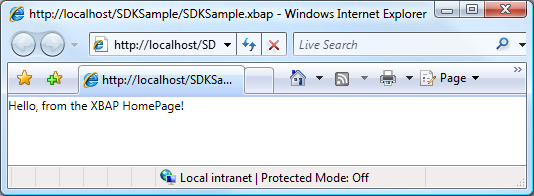  
  
> [!NOTE]
>  For more information regarding the development and deployment of                              [!INCLUDE[TLA2#tla_xbap#plural](../../../../includes/tla2sharptla-xbapsharpplural-md.md)], see                              [WPF XAML Browser Applications Overview](../../../../docs/framework/wpf/app-development/wpf-xaml-browser-applications-overview.md) and                              [Deploying a WPF Application](../../../../docs/framework/wpf/app-development/deploying-a-wpf-application-wpf.md).  
  
   
### Configuring the Host Window's Title, Width, and Height  
 One thing you may have noticed from the previous figure is that the title of both the browser and the tab panel is the                          [!INCLUDE[TLA2#tla_uri](../../../../includes/tla2sharptla-uri-md.md)] for the                          [!INCLUDE[TLA2#tla_xbap](../../../../includes/tla2sharptla-xbap-md.md)]. Besides being long, the title is neither attractive nor informative. For this reason,                          <xref:System.Windows.Controls.Page> offers a way for you to change the title by setting the                          <xref:System.Windows.Controls.Page.WindowTitle%2A> property. Furthermore, you can configure the width and height of the browser window by setting                          <xref:System.Windows.Controls.Page.WindowWidth%2A> and                          <xref:System.Windows.Controls.Page.WindowHeight%2A>, respectively.  
  
 <xref:System.Windows.Controls.Page.WindowTitle%2A>,                          <xref:System.Windows.Controls.Page.WindowWidth%2A>, and                          <xref:System.Windows.Controls.Page.WindowHeight%2A> can be set declaratively in markup, as shown in the following example.  
  
 [!code-xaml[NavigationOverviewSnippets#HomePageMARKUP](../../../../samples/snippets/csharp/VS_Snippets_Wpf/NavigationOverviewSnippets/CSharp/HomePage.xaml#homepagemarkup)]  
  
 The result is shown in the following figure.  
  
 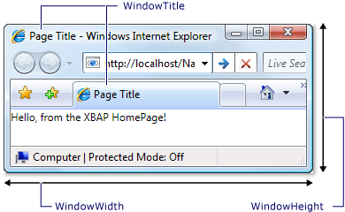  
  
   
### Hyperlink Navigation  
 A typical                          [!INCLUDE[TLA2#tla_xbap](../../../../includes/tla2sharptla-xbap-md.md)] comprises several pages. The simplest way to navigate from one page to another is to use a                          <xref:System.Windows.Documents.Hyperlink>. You can declaratively add a                          <xref:System.Windows.Documents.Hyperlink> to a                          <xref:System.Windows.Controls.Page> by using the                          `Hyperlink` element, which is shown in the following markup.  
  
 [!code-xaml[NavigationOverviewSnippets#HyperlinkXAML1](../../../../samples/snippets/csharp/VS_Snippets_Wpf/NavigationOverviewSnippets/CSharp/PageWithHyperlink.xaml#hyperlinkxaml1)]  
[!code-xaml[NavigationOverviewSnippets#HyperlinkXAML2](../../../../samples/snippets/csharp/VS_Snippets_Wpf/NavigationOverviewSnippets/CSharp/PageWithHyperlink.xaml#hyperlinkxaml2)]  
[!code-xaml[NavigationOverviewSnippets#HyperlinkXAML3](../../../../samples/snippets/csharp/VS_Snippets_Wpf/NavigationOverviewSnippets/CSharp/PageWithHyperlink.xaml#hyperlinkxaml3)]  
  
 A                          `Hyperlink` element requires the following:  
  
-   The pack                                  [!INCLUDE[TLA2#tla_uri](../../../../includes/tla2sharptla-uri-md.md)] of the                                  <xref:System.Windows.Controls.Page> to navigate to, as specified by the                                  `NavigateUri` attribute.  
  
-   Content that a user can click to initiate the navigation, such as text and images (for the content that the                                  `Hyperlink` element can contain, see                                  <xref:System.Windows.Documents.Hyperlink>).  
  
 The following figure shows an                          [!INCLUDE[TLA2#tla_xbap](../../../../includes/tla2sharptla-xbap-md.md)] with a                          <xref:System.Windows.Controls.Page> that has a                          <xref:System.Windows.Documents.Hyperlink>.  
  
 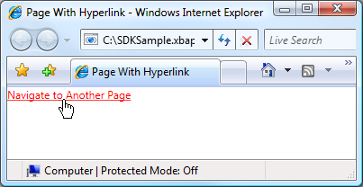  
  
 As you would expect, clicking the                          <xref:System.Windows.Documents.Hyperlink> causes the                          [!INCLUDE[TLA2#tla_xbap](../../../../includes/tla2sharptla-xbap-md.md)] to navigate to the                          <xref:System.Windows.Controls.Page> that is identified by the                          `NavigateUri` attribute. Additionally, the                          [!INCLUDE[TLA2#tla_xbap](../../../../includes/tla2sharptla-xbap-md.md)] adds an entry for the previous                          <xref:System.Windows.Controls.Page> to the Recent Pages list in                          [!INCLUDE[TLA2#tla_ie](../../../../includes/tla2sharptla-ie-md.md)]. This is shown in the following figure.  
  
   
  
 As well as supporting navigation from one                          <xref:System.Windows.Controls.Page> to another,                          <xref:System.Windows.Documents.Hyperlink> also supports fragment navigation.  
  
   
### Fragment Navigation  
 *Fragment navigation* is the navigation to a content fragment in either the current                          <xref:System.Windows.Controls.Page> or another                          <xref:System.Windows.Controls.Page>. In                          [!INCLUDE[TLA2#tla_wpf](../../../../includes/tla2sharptla-wpf-md.md)], a content fragment is the content that is contained by a named element. A named element is an element that has its                          `Name` attribute set. The following markup shows a named                          `TextBlock` element that contains a content fragment.  
  
 [!code-xaml[NavigationOverviewSnippets#PageWithContentFragmentsMARKUP1](../../../../samples/snippets/csharp/VS_Snippets_Wpf/NavigationOverviewSnippets/CSharp/PageWithFragments.xaml#pagewithcontentfragmentsmarkup1)]  
[!code-xaml[NavigationOverviewSnippets#PageWithContentFragmentsMARKUP2](../../../../samples/snippets/csharp/VS_Snippets_Wpf/NavigationOverviewSnippets/CSharp/PageWithFragments.xaml#pagewithcontentfragmentsmarkup2)]  
[!code-xaml[NavigationOverviewSnippets#PageWithContentFragmentsMARKUP3](../../../../samples/snippets/csharp/VS_Snippets_Wpf/NavigationOverviewSnippets/CSharp/PageWithFragments.xaml#pagewithcontentfragmentsmarkup3)]  
  
 For a                          <xref:System.Windows.Documents.Hyperlink> to navigate to a content fragment, the                          `NavigateUri` attribute must include the following:  
  
-   The                                  [!INCLUDE[TLA2#tla_uri](../../../../includes/tla2sharptla-uri-md.md)] of the                                  <xref:System.Windows.Controls.Page> with the content fragment to navigate to.  
  
-   A "#" character.  
  
-   The name of the element on the                                  <xref:System.Windows.Controls.Page> that contains the content fragment.  
  
 A fragment                          [!INCLUDE[TLA2#tla_uri](../../../../includes/tla2sharptla-uri-md.md)] has the following format.  
  
 *PageURI* `#` *ElementName*  
  
 The following shows an example of a                          `Hyperlink` that is configured to navigate to a content fragment.  
  
 [!code-xaml[NavigationOverviewSnippets#PageThatNavigatesXAML1](../../../../samples/snippets/csharp/VS_Snippets_Wpf/NavigationOverviewSnippets/CSharp/PageThatNavigatesToFragment.xaml#pagethatnavigatesxaml1)]  
[!code-xaml[NavigationOverviewSnippets#PageThatNavigatesXAML2](../../../../samples/snippets/csharp/VS_Snippets_Wpf/NavigationOverviewSnippets/CSharp/PageThatNavigatesToFragment.xaml#pagethatnavigatesxaml2)]  
[!code-xaml[NavigationOverviewSnippets#PageThatNavigatesXAML3](../../../../samples/snippets/csharp/VS_Snippets_Wpf/NavigationOverviewSnippets/CSharp/PageThatNavigatesToFragment.xaml#pagethatnavigatesxaml3)]  
  
> [!NOTE]
>  This section describes the default fragment navigation implementation in                              [!INCLUDE[TLA2#tla_wpf](../../../../includes/tla2sharptla-wpf-md.md)].                              [!INCLUDE[TLA2#tla_wpf](../../../../includes/tla2sharptla-wpf-md.md)] also allows you to implement your own fragment navigation scheme which, in part, requires handling the                              <xref:System.Windows.Navigation.NavigationService.FragmentNavigation?displayProperty=fullName> event.  
  
> [!IMPORTANT]
>  You can navigate to fragments in loose                              [!INCLUDE[TLA2#tla_xaml](../../../../includes/tla2sharptla-xaml-md.md)] pages (markup-only                              [!INCLUDE[TLA2#tla_xaml](../../../../includes/tla2sharptla-xaml-md.md)] files with                              `Page` as the root element) only if the pages can be browsed via                              [!INCLUDE[TLA2#tla_http](../../../../includes/tla2sharptla-http-md.md)].  
>   
>  However, a loose                              [!INCLUDE[TLA2#tla_xaml](../../../../includes/tla2sharptla-xaml-md.md)] page can navigate to its own fragments.  
  
   
### Navigation Service  
 While                          <xref:System.Windows.Documents.Hyperlink> allows a user to initiate navigation to a particular                          <xref:System.Windows.Controls.Page>, the work of locating and downloading the page is performed by the                          <xref:System.Windows.Navigation.NavigationService> class. Essentially,                          <xref:System.Windows.Navigation.NavigationService> provides the ability to process a navigation request on behalf of client code, such as the                          <xref:System.Windows.Documents.Hyperlink>. Additionally,                          <xref:System.Windows.Navigation.NavigationService> implements higher-level support for tracking and influencing a navigation request.  
  
 When a                          <xref:System.Windows.Documents.Hyperlink> is clicked,                          [!INCLUDE[TLA2#tla_wpf](../../../../includes/tla2sharptla-wpf-md.md)] calls                          <xref:System.Windows.Navigation.NavigationService.Navigate%2A?displayProperty=fullName> to locate and download the                          <xref:System.Windows.Controls.Page> at the specified pack                          [!INCLUDE[TLA2#tla_uri](../../../../includes/tla2sharptla-uri-md.md)]. The downloaded                          <xref:System.Windows.Controls.Page> is converted to a tree of objects whose root object is an instance of the downloaded                          <xref:System.Windows.Controls.Page>. A reference to the root                          <xref:System.Windows.Controls.Page> object is stored in the                          <xref:System.Windows.Navigation.NavigationService.Content%2A?displayProperty=fullName> property. The pack                          [!INCLUDE[TLA2#tla_uri](../../../../includes/tla2sharptla-uri-md.md)] for the content that was navigated to is stored in the                          <xref:System.Windows.Navigation.NavigationService.Source%2A?displayProperty=fullName> property, while the                          <xref:System.Windows.Navigation.NavigationService.CurrentSource%2A?displayProperty=fullName> stores the pack                          [!INCLUDE[TLA2#tla_uri](../../../../includes/tla2sharptla-uri-md.md)] for the last page that was navigated to.  
  
> [!NOTE]
>  It is possible for a                              [!INCLUDE[TLA2#tla_wpf](../../../../includes/tla2sharptla-wpf-md.md)] application to have more than one currently active                              <xref:System.Windows.Navigation.NavigationService>. For more information, see                              [Navigation Hosts](#Navigation_Hosts) later in this topic.  
  
   
### Programmatic Navigation with the Navigation Service  
 You don't need to know about                          <xref:System.Windows.Navigation.NavigationService> if navigation is implemented declaratively in markup using                          <xref:System.Windows.Documents.Hyperlink>, because                          <xref:System.Windows.Documents.Hyperlink> uses the                          <xref:System.Windows.Navigation.NavigationService> on your behalf. This means that, as long as either the direct or indirect parent of a                          <xref:System.Windows.Documents.Hyperlink> is a navigation host (see                          [Navigation Hosts](#Navigation_Hosts)),                          <xref:System.Windows.Documents.Hyperlink> will be able to find and use the navigation host's navigation service to process a navigation request.  
  
 However, there are situations when you need to use                          <xref:System.Windows.Navigation.NavigationService> directly, including the following:  
  
-   When you need to instantiate a                                  <xref:System.Windows.Controls.Page> using a non-default constructor.  
  
-   When you need to set properties on the                                  <xref:System.Windows.Controls.Page> before you navigate to it.  
  
-   When the                                  <xref:System.Windows.Controls.Page> that needs to be navigated to can only be determined at run time.  
  
 In these situations, you need to write code to programmatically initiate navigation by calling the                          <xref:System.Windows.Navigation.NavigationService.Navigate%2A> method of the                          <xref:System.Windows.Navigation.NavigationService> object. That requires getting a reference to a                          <xref:System.Windows.Navigation.NavigationService>.  
  
#### Getting a Reference to the NavigationService  
 For reasons that are covered in the                                  [Navigation Hosts](#Navigation_Hosts) section, a                                  [!INCLUDE[TLA2#tla_wpf](../../../../includes/tla2sharptla-wpf-md.md)] application can have more than one                                  <xref:System.Windows.Navigation.NavigationService>. This means that your code needs a way to find a                                  <xref:System.Windows.Navigation.NavigationService>, which is usually the                                  <xref:System.Windows.Navigation.NavigationService> that navigated to the current                                  <xref:System.Windows.Controls.Page>. You can get a reference to a                                  <xref:System.Windows.Navigation.NavigationService> by calling the                                  `static`<xref:System.Windows.Navigation.NavigationService.GetNavigationService%2A?displayProperty=fullName> method. To get the                                  <xref:System.Windows.Navigation.NavigationService> that navigated to a particular                                  <xref:System.Windows.Controls.Page>, you pass a reference to the                                  <xref:System.Windows.Controls.Page> as the argument of the                                  <xref:System.Windows.Navigation.NavigationService.GetNavigationService%2A> method. The following code shows how to get the                                  <xref:System.Windows.Navigation.NavigationService> for the current                                  <xref:System.Windows.Controls.Page>.  
  
 [!code-csharp[NavigationOverviewSnippets#GetNSCODEBEHIND1](../../../../samples/snippets/csharp/VS_Snippets_Wpf/NavigationOverviewSnippets/CSharp/GetNSPage.xaml.cs#getnscodebehind1)]  
[!code-csharp[NavigationOverviewSnippets#GetNSCODEBEHIND2](../../../../samples/snippets/csharp/VS_Snippets_Wpf/NavigationOverviewSnippets/CSharp/GetNSPage.xaml.cs#getnscodebehind2)]
[!code-vb[NavigationOverviewSnippets#GetNSCODEBEHIND2](../../../../samples/snippets/visualbasic/VS_Snippets_Wpf/NavigationOverviewSnippets/VisualBasic/GetNSPage.xaml.vb#getnscodebehind2)]  
  
 As a shortcut for finding the                                  <xref:System.Windows.Navigation.NavigationService> for a                                  <xref:System.Windows.Controls.Page>,                                  <xref:System.Windows.Controls.Page> implements the                                  <xref:System.Windows.Controls.Page.NavigationService%2A> property. This is shown in the following example.  
  
 [!code-csharp[NavigationOverviewSnippets#GetNSShortcutCODEBEHIND1](../../../../samples/snippets/csharp/VS_Snippets_Wpf/NavigationOverviewSnippets/CSharp/GetNSPageShortCut.xaml.cs#getnsshortcutcodebehind1)]  
[!code-csharp[NavigationOverviewSnippets#GetNSShortcutCODEBEHIND2](../../../../samples/snippets/csharp/VS_Snippets_Wpf/NavigationOverviewSnippets/CSharp/GetNSPageShortCut.xaml.cs#getnsshortcutcodebehind2)]
[!code-vb[NavigationOverviewSnippets#GetNSShortcutCODEBEHIND2](../../../../samples/snippets/visualbasic/VS_Snippets_Wpf/NavigationOverviewSnippets/VisualBasic/GetNSPageShortCut.xaml.vb#getnsshortcutcodebehind2)]  
  
> [!NOTE]
>  A                                      <xref:System.Windows.Controls.Page> can only get a reference to its                                      <xref:System.Windows.Navigation.NavigationService> when                                      <xref:System.Windows.Controls.Page> raises the                                      <xref:System.Windows.FrameworkElement.Loaded> event.  
  
#### Programmatic Navigation to a Page Object  
 The following example shows how to use the                                  <xref:System.Windows.Navigation.NavigationService> to programmatically navigate to a                                  <xref:System.Windows.Controls.Page>. Programmatic navigation is required because the                                  <xref:System.Windows.Controls.Page> that is being navigated to can only be instantiated using a single, non-default constructor. The                                  <xref:System.Windows.Controls.Page> with the non-default constructor is shown in the following markup and code.  
  
 [!code-xaml[NavigationOverviewSnippets#PageWithNonDefaultConstructorXAML](../../../../samples/snippets/csharp/VS_Snippets_Wpf/NavigationOverviewSnippets/CSharp/PageWithNonDefaultConstructor.xaml#pagewithnondefaultconstructorxaml)]  
  
 [!code-csharp[NavigationOverviewSnippets#PageWithNonDefaultConstructorCODEBEHIND](../../../../samples/snippets/csharp/VS_Snippets_Wpf/NavigationOverviewSnippets/CSharp/PageWithNonDefaultConstructor.xaml.cs#pagewithnondefaultconstructorcodebehind)]
 [!code-vb[NavigationOverviewSnippets#PageWithNonDefaultConstructorCODEBEHIND](../../../../samples/snippets/visualbasic/VS_Snippets_Wpf/NavigationOverviewSnippets/VisualBasic/PageWithNonDefaultConstructor.xaml.vb#pagewithnondefaultconstructorcodebehind)]  
  
 The                                  <xref:System.Windows.Controls.Page> that navigates to the                                  <xref:System.Windows.Controls.Page> with the non-default constructor is shown in the following markup and code.  
  
 [!code-xaml[NavigationOverviewSnippets#NSNavigationPageXAML](../../../../samples/snippets/csharp/VS_Snippets_Wpf/NavigationOverviewSnippets/CSharp/NSNavigationPage.xaml#nsnavigationpagexaml)]  
  
 [!code-csharp[NavigationOverviewSnippets#NSNavigationPageCODEBEHIND](../../../../samples/snippets/csharp/VS_Snippets_Wpf/NavigationOverviewSnippets/CSharp/NSNavigationPage.xaml.cs#nsnavigationpagecodebehind)]
 [!code-vb[NavigationOverviewSnippets#NSNavigationPageCODEBEHIND](../../../../samples/snippets/visualbasic/VS_Snippets_Wpf/NavigationOverviewSnippets/VisualBasic/NSNavigationPage.xaml.vb#nsnavigationpagecodebehind)]  
  
 When the                                  <xref:System.Windows.Documents.Hyperlink> on this                                  <xref:System.Windows.Controls.Page> is clicked, navigation is initiated by instantiating the                                  <xref:System.Windows.Controls.Page> to navigate to using the non-default constructor and calling the                                  <xref:System.Windows.Navigation.NavigationService.Navigate%2A?displayProperty=fullName> method.                                  <xref:System.Windows.Navigation.NavigationService.Navigate%2A> accepts a reference to the object that the                                  <xref:System.Windows.Navigation.NavigationService> will navigate to, rather than a pack                                  [!INCLUDE[TLA2#tla_uri](../../../../includes/tla2sharptla-uri-md.md)].  
  
#### Programmatic Navigation with a Pack URI  
 If you need to construct a pack                                  [!INCLUDE[TLA2#tla_uri](../../../../includes/tla2sharptla-uri-md.md)] programmatically (when you can only determine the pack                                  [!INCLUDE[TLA2#tla_uri](../../../../includes/tla2sharptla-uri-md.md)] at run time, for example), you can use the                                  <xref:System.Windows.Navigation.NavigationService.Navigate%2A?displayProperty=fullName> method. This is shown in the following example.  
  
 [!code-xaml[NavigationOverviewSnippets#NSUriNavigationPageXAML](../../../../samples/snippets/csharp/VS_Snippets_Wpf/NavigationOverviewSnippets/CSharp/NSUriNavigationPage.xaml#nsurinavigationpagexaml)]  
  
 [!code-csharp[NavigationOverviewSnippets#NSUriNavigationPageCODEBEHIND](../../../../samples/snippets/csharp/VS_Snippets_Wpf/NavigationOverviewSnippets/CSharp/NSUriNavigationPage.xaml.cs#nsurinavigationpagecodebehind)]
 [!code-vb[NavigationOverviewSnippets#NSUriNavigationPageCODEBEHIND](../../../../samples/snippets/visualbasic/VS_Snippets_Wpf/NavigationOverviewSnippets/VisualBasic/NSUriNavigationPage.xaml.vb#nsurinavigationpagecodebehind)]  
  
#### Refreshing the Current Page  
 A                                  <xref:System.Windows.Controls.Page> is not downloaded if it has the same pack                                  [!INCLUDE[TLA2#tla_uri](../../../../includes/tla2sharptla-uri-md.md)] as the pack                                  [!INCLUDE[TLA2#tla_uri](../../../../includes/tla2sharptla-uri-md.md)] that is stored in the                                  <xref:System.Windows.Navigation.NavigationService.Source%2A?displayProperty=fullName> property. To force                                  [!INCLUDE[TLA2#tla_wpf](../../../../includes/tla2sharptla-wpf-md.md)] to download the current page again, you can call the                                  <xref:System.Windows.Navigation.NavigationService.Refresh%2A?displayProperty=fullName> method, as shown in the following example.  
  
 [!code-xaml[NavigationOverviewSnippets#NSRefreshNavigationPageXAML1](../../../../samples/snippets/csharp/VS_Snippets_Wpf/NavigationOverviewSnippets/CSharp/NSRefreshNavigationPage.xaml#nsrefreshnavigationpagexaml1)]  
  
 [!code-csharp[NavigationOverviewSnippets#NSRefreshNavigationPageCODEBEHIND1](../../../../samples/snippets/csharp/VS_Snippets_Wpf/NavigationOverviewSnippets/CSharp/NSRefreshNavigationPage.xaml.cs#nsrefreshnavigationpagecodebehind1)]
 [!code-vb[NavigationOverviewSnippets#NSRefreshNavigationPageCODEBEHIND1](../../../../samples/snippets/visualbasic/VS_Snippets_Wpf/NavigationOverviewSnippets/VisualBasic/NSRefreshNavigationPage.xaml.vb#nsrefreshnavigationpagecodebehind1)]  
[!code-csharp[NavigationOverviewSnippets#NSRefreshNavigationPageCODEBEHIND2](../../../../samples/snippets/csharp/VS_Snippets_Wpf/NavigationOverviewSnippets/CSharp/NSRefreshNavigationPage.xaml.cs#nsrefreshnavigationpagecodebehind2)]
[!code-vb[NavigationOverviewSnippets#NSRefreshNavigationPageCODEBEHIND2](../../../../samples/snippets/visualbasic/VS_Snippets_Wpf/NavigationOverviewSnippets/VisualBasic/NSRefreshNavigationPage.xaml.vb#nsrefreshnavigationpagecodebehind2)]  
  
   
### Navigation Lifetime  
 There are many ways to initiate navigation, as you've seen. When navigation is initiated, and while navigation is in progress, you can track and influence the navigation using the following events that are implemented by                          <xref:System.Windows.Navigation.NavigationService>:  
  
-   <xref:System.Windows.Navigation.NavigationService.Navigating>. Occurs when a new navigation is requested. Can be used to cancel the navigation.  
  
-   <xref:System.Windows.Navigation.NavigationService.NavigationProgress>. Occurs periodically during a download to provide navigation progress information.  
  
-   <xref:System.Windows.Navigation.NavigationService.Navigated>. Occurs when the page has been located and downloaded.  
  
-   <xref:System.Windows.Navigation.NavigationService.NavigationStopped>. Occurs when the navigation is stopped (by calling                                  <xref:System.Windows.Navigation.NavigationService.StopLoading%2A>), or when a new navigation is requested while a current navigation is in progress.  
  
-   <xref:System.Windows.Navigation.NavigationService.NavigationFailed>. Occurs when an error is raised while navigating to the requested content.  
  
-   <xref:System.Windows.Navigation.NavigationService.LoadCompleted>. Occurs when content that was navigated to is loaded and parsed, and has begun rendering.  
  
-   <xref:System.Windows.Navigation.NavigationService.FragmentNavigation>. Occurs when navigation to a content fragment begins, which happens:  
  
    -   Immediately, if the desired fragment is in the current content.  
  
    -   After the source content has been loaded, if the desired fragment is in different content.  
  
 The navigation events are raised in the order that is illustrated by the following figure.  
  
   
  
 In general, a                          <xref:System.Windows.Controls.Page> isn't concerned about these events. It is more likely that an application is concerned with them and, for that reason, these events are also raised by the                          <xref:System.Windows.Application> class:  
  
-   <xref:System.Windows.Application.Navigating?displayProperty=fullName>  
  
-   <xref:System.Windows.Application.NavigationProgress?displayProperty=fullName>  
  
-   <xref:System.Windows.Application.Navigated?displayProperty=fullName>  
  
-   <xref:System.Windows.Application.NavigationFailed?displayProperty=fullName>  
  
-   <xref:System.Windows.Application.NavigationStopped?displayProperty=fullName>  
  
-   <xref:System.Windows.Application.LoadCompleted?displayProperty=fullName>  
  
-   <xref:System.Windows.Application.FragmentNavigation?displayProperty=fullName>  
  
 Every time                          <xref:System.Windows.Navigation.NavigationService> raises an event, the                          <xref:System.Windows.Application> class raises the corresponding event.                          <xref:System.Windows.Controls.Frame> and                          <xref:System.Windows.Navigation.NavigationWindow> offer the same events to detect navigation within their respective scopes.  
  
 In some cases, a                          <xref:System.Windows.Controls.Page> might be interested in these events. For example, a                          <xref:System.Windows.Controls.Page> might handle the                          <xref:System.Windows.Navigation.NavigationService.Navigating?displayProperty=fullName> event to determine whether or not to cancel navigation away from itself. This is shown in the following example.  
  
 [!code-xaml[NavigationOverviewSnippets#CancelNavigationPageXAML](../../../../samples/snippets/csharp/VS_Snippets_Wpf/NavigationOverviewSnippets/CSharp/CancelNavigationPage.xaml#cancelnavigationpagexaml)]  
  
 [!code-csharp[NavigationOverviewSnippets#CancelNavigationPageCODEBEHIND](../../../../samples/snippets/csharp/VS_Snippets_Wpf/NavigationOverviewSnippets/CSharp/CancelNavigationPage.xaml.cs#cancelnavigationpagecodebehind)]
 [!code-vb[NavigationOverviewSnippets#CancelNavigationPageCODEBEHIND](../../../../samples/snippets/visualbasic/VS_Snippets_Wpf/NavigationOverviewSnippets/VisualBasic/CancelNavigationPage.xaml.vb#cancelnavigationpagecodebehind)]  
  
 If you register a handler with a navigation event from a                          <xref:System.Windows.Controls.Page>, as the preceding example does, you must also unregister the event handler. If you don't, there may be side effects with respect to how                          [!INCLUDE[TLA2#tla_wpf](../../../../includes/tla2sharptla-wpf-md.md)] navigation remembers                          <xref:System.Windows.Controls.Page> navigation using the journal.  
  
   
### Remembering Navigation with the Journal  
 [!INCLUDE[TLA2#tla_wpf](../../../../includes/tla2sharptla-wpf-md.md)] uses two stacks to remember the pages that you have navigated from: a back stack and a forward stack. When you navigate from the current                          <xref:System.Windows.Controls.Page> to a new                          <xref:System.Windows.Controls.Page> or forward to an existing                          <xref:System.Windows.Controls.Page>, the current                          <xref:System.Windows.Controls.Page> is added to the                          *back stack*. When you navigate from the current                          <xref:System.Windows.Controls.Page> back to the previous                          <xref:System.Windows.Controls.Page>, the current                          <xref:System.Windows.Controls.Page> is added to the                          *forward stack*. The back stack, the forward stack, and the functionality to manage them, are collectively referred to as the journal. Each item in the back stack and the forward stack is an instance of the                          <xref:System.Windows.Navigation.JournalEntry> class, and is referred to as a                          *journal entry*.  
  
#### Navigating the Journal from Internet Explorer  
 Conceptually, the journal operates the same way that the                                  **Back** and                                  **Forward** buttons in                                  [!INCLUDE[TLA2#tla_ie](../../../../includes/tla2sharptla-ie-md.md)] do. These are shown in the following figure.  
  
   
  
 For                                  [!INCLUDE[TLA2#tla_xbap#plural](../../../../includes/tla2sharptla-xbapsharpplural-md.md)] that are hosted by                                  [!INCLUDE[TLA2#tla_ie](../../../../includes/tla2sharptla-ie-md.md)],                                  [!INCLUDE[TLA2#tla_wpf](../../../../includes/tla2sharptla-wpf-md.md)] integrates the journal into the navigation                                  [!INCLUDE[TLA2#tla_ui](../../../../includes/tla2sharptla-ui-md.md)] of                                  [!INCLUDE[TLA2#tla_ie](../../../../includes/tla2sharptla-ie-md.md)]. This allows users to navigate pages in an                                  [!INCLUDE[TLA2#tla_xbap](../../../../includes/tla2sharptla-xbap-md.md)] by using the                                  **Back**,                                  **Forward**, and                                  **Recent Pages** buttons in                                  [!INCLUDE[TLA2#tla_ie](../../../../includes/tla2sharptla-ie-md.md)]. The journal is not integrated into                                  [!INCLUDE[TLA2#tla_ie6](../../../../includes/tla2sharptla-ie6-md.md)] in the same way it is for                                  [!INCLUDE[TLA2#tla_ie7](../../../../includes/tla2sharptla-ie7-md.md)] or Internet Explorer 8. Instead,                                  [!INCLUDE[TLA2#tla_wpf](../../../../includes/tla2sharptla-wpf-md.md)] renders a substitute navigation                                  [!INCLUDE[TLA2#tla_ui](../../../../includes/tla2sharptla-ui-md.md)].  
  
> [!IMPORTANT]
>  In                                      [!INCLUDE[TLA2#tla_ie](../../../../includes/tla2sharptla-ie-md.md)], when a user navigates away from and back to an                                      [!INCLUDE[TLA2#tla_xbap](../../../../includes/tla2sharptla-xbap-md.md)], only the journal entries for pages that were not kept alive are retained in the journal. For discussion on keeping pages alive, see                                      [Page Lifetime and the Journal](#PageLifetime) later in this topic.  
  
 By default, the text for each                                  <xref:System.Windows.Controls.Page> that appears in the                                  **Recent Pages** list of                                  [!INCLUDE[TLA2#tla_ie](../../../../includes/tla2sharptla-ie-md.md)] is the                                  [!INCLUDE[TLA2#tla_uri](../../../../includes/tla2sharptla-uri-md.md)] for the                                  <xref:System.Windows.Controls.Page>. In many cases, this is not particularly meaningful to the user. Fortunately, you can change the text using one the following options:  
  
1.  The attached                                          `JournalEntry.Name` attribute value.  
  
2.  The                                          `Page.Title` attribute value.  
  
3.  The                                          `Page.WindowTitle` attribute value and the                                          [!INCLUDE[TLA2#tla_uri](../../../../includes/tla2sharptla-uri-md.md)] for the current                                          <xref:System.Windows.Controls.Page>.  
  
4.  The                                          [!INCLUDE[TLA2#tla_uri](../../../../includes/tla2sharptla-uri-md.md)] for the current                                          <xref:System.Windows.Controls.Page>. (Default)  
  
 The order in which the options are listed matches the order of precedence for finding the text. For example, if                                  `JournalEntry.Name` is set, the other values are ignored.  
  
 The following example uses the                                  `Page.Title` attribute to change the text that appears for a journal entry.  
  
 [!code-xaml[NavigationOverviewSnippets#PageTitleMARKUP1](../../../../samples/snippets/csharp/VS_Snippets_Wpf/NavigationOverviewSnippets/CSharp/PageWithTitle.xaml#pagetitlemarkup1)]  
[!code-xaml[NavigationOverviewSnippets#PageTitleMARKUP2](../../../../samples/snippets/csharp/VS_Snippets_Wpf/NavigationOverviewSnippets/CSharp/PageWithTitle.xaml#pagetitlemarkup2)]  
  
 [!code-csharp[NavigationOverviewSnippets#PageTitleCODEBEHIND1](../../../../samples/snippets/csharp/VS_Snippets_Wpf/NavigationOverviewSnippets/CSharp/PageWithTitle.xaml.cs#pagetitlecodebehind1)]
 [!code-vb[NavigationOverviewSnippets#PageTitleCODEBEHIND1](../../../../samples/snippets/visualbasic/VS_Snippets_Wpf/NavigationOverviewSnippets/VisualBasic/PageWithTitle.xaml.vb#pagetitlecodebehind1)]  
[!code-csharp[NavigationOverviewSnippets#PageTitleCODEBEHIND2](../../../../samples/snippets/csharp/VS_Snippets_Wpf/NavigationOverviewSnippets/CSharp/PageWithTitle.xaml.cs#pagetitlecodebehind2)]
[!code-vb[NavigationOverviewSnippets#PageTitleCODEBEHIND2](../../../../samples/snippets/visualbasic/VS_Snippets_Wpf/NavigationOverviewSnippets/VisualBasic/PageWithTitle.xaml.vb#pagetitlecodebehind2)]  
  
#### Navigating the Journal Using WPF  
 Although a user can navigate the journal by using the                                  **Back**,                                  **Forward**, and                                  **Recent Pages** in                                  [!INCLUDE[TLA2#tla_ie](../../../../includes/tla2sharptla-ie-md.md)], you can also navigate the journal using both declarative and programmatic mechanisms provided by                                  [!INCLUDE[TLA2#tla_wpf](../../../../includes/tla2sharptla-wpf-md.md)]. One reason to do this is to provide custom navigation                                  [!INCLUDE[TLA2#tla_ui#plural](../../../../includes/tla2sharptla-uisharpplural-md.md)] in your pages.  
  
 You can declaratively add journal navigation support by using the navigation commands exposed by                                  <xref:System.Windows.Input.NavigationCommands>. The following example demonstrates how to use the                                  `BrowseBack` navigation command.  
  
 [!code-xaml[NavigationOverviewSnippets#NavigationCommandsPageXAML1](../../../../samples/snippets/csharp/VS_Snippets_Wpf/NavigationOverviewSnippets/CSharp/NavigationCommandsPage.xaml#navigationcommandspagexaml1)]  
[!code-xaml[NavigationOverviewSnippets#NavigationCommandsPageXAML2](../../../../samples/snippets/csharp/VS_Snippets_Wpf/NavigationOverviewSnippets/CSharp/NavigationCommandsPage.xaml#navigationcommandspagexaml2)]  
[!code-xaml[NavigationOverviewSnippets#NavigationCommandsPageXAML3](../../../../samples/snippets/csharp/VS_Snippets_Wpf/NavigationOverviewSnippets/CSharp/NavigationCommandsPage.xaml#navigationcommandspagexaml3)]  
[!code-xaml[NavigationOverviewSnippets#NavigationCommandsPageXAML4](../../../../samples/snippets/csharp/VS_Snippets_Wpf/NavigationOverviewSnippets/CSharp/NavigationCommandsPage.xaml#navigationcommandspagexaml4)]  
  
 You can programmatically navigate the journal by using one of the following members of the                                  <xref:System.Windows.Navigation.NavigationService> class:  
  
-   <xref:System.Windows.Navigation.NavigationService.GoBack%2A>  
  
-   <xref:System.Windows.Navigation.NavigationService.GoForward%2A>  
  
-   <xref:System.Windows.Navigation.NavigationService.CanGoBack%2A>  
  
-   <xref:System.Windows.Navigation.NavigationService.CanGoForward%2A>  
  
 The journal can also be manipulated programmatically, as discussed in                                  [Retaining Content State with Navigation History](#RetainingContentStateWithNavigationHistory) later in this topic.  
  
   
### Page Lifetime and the Journal  
 Consider an                          [!INCLUDE[TLA2#tla_xbap](../../../../includes/tla2sharptla-xbap-md.md)] with several pages that contain rich content, including graphics, animations, and media. The memory footprint for pages like these could be quite large, particularly if video and audio media are used. Given that the journal "remembers" pages that have been navigated to, such an                          [!INCLUDE[TLA2#tla_xbap](../../../../includes/tla2sharptla-xbap-md.md)] could quickly consume a large and noticeable amount of memory.  
  
 For this reason, the default behavior of the journal is to store                          <xref:System.Windows.Controls.Page> metadata in each journal entry rather than a reference to a                          <xref:System.Windows.Controls.Page> object. When a journal entry is navigated to, its                          <xref:System.Windows.Controls.Page> metadata is used to create a new instance of the specified                          <xref:System.Windows.Controls.Page>. As a consequence, each                          <xref:System.Windows.Controls.Page> that is navigated has the lifetime that is illustrated by the following figure.  
  
 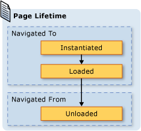  
  
 Although using the default journaling behavior can save on memory consumption, per-page rendering performance might be reduced; reinstantiating a                          <xref:System.Windows.Controls.Page> can be time-intensive, particularly if it has a lot of content. If you need to retain a                          <xref:System.Windows.Controls.Page> instance in the journal, you can draw on two techniques for doing so. First, you can programmatically navigate to a                          <xref:System.Windows.Controls.Page> object by calling the                          <xref:System.Windows.Navigation.NavigationService.Navigate%2A?displayProperty=fullName> method.  
  
 Second, you can specify that                          [!INCLUDE[TLA2#tla_wpf](../../../../includes/tla2sharptla-wpf-md.md)] retain an instance of a                          <xref:System.Windows.Controls.Page> in the journal by setting the                          <xref:System.Windows.Controls.Page.KeepAlive%2A> property to                          `true` (the default is                          `false`). As shown in the following example, you can set                          <xref:System.Windows.Controls.Page.KeepAlive%2A> declaratively in markup.  
  
 [!code-xaml[NavigationOverviewSnippets#KeepAlivePageXAML](../../../../samples/snippets/csharp/VS_Snippets_Wpf/NavigationOverviewSnippets/CSharp/KeepAlivePage.xaml#keepalivepagexaml)]  
  
 The lifetime of a                          <xref:System.Windows.Controls.Page> that is kept alive is subtly different from one that is not. The first time a                          <xref:System.Windows.Controls.Page> that is kept alive is navigated to, it is instantiated just like a                          <xref:System.Windows.Controls.Page> that is not kept alive. However, because an instance of the                          <xref:System.Windows.Controls.Page> is retained in the journal, it is never instantiated again for as long as it remains in the journal. Consequently, if a                          <xref:System.Windows.Controls.Page> has initialization logic that needs to be called every time the                          <xref:System.Windows.Controls.Page> is navigated to, you should move it from the constructor into a handler for the                          <xref:System.Windows.FrameworkElement.Loaded> event. As shown in the following figure, the                          <xref:System.Windows.FrameworkElement.Loaded> and                          <xref:System.Windows.FrameworkElement.Unloaded> events are still raised each time a                          <xref:System.Windows.Controls.Page> is navigated to and from, respectively.  
  
   
  
 When a                          <xref:System.Windows.Controls.Page> is not kept alive, you should not do either of the following:  
  
-   Store a reference to it, or any part of it.  
  
-   Register event handlers with events that are not implemented by it.  
  
 Doing either of these will create references that force the                          <xref:System.Windows.Controls.Page> to be retained in memory, even after it has been removed from the journal.  
  
 In general, you should prefer the default                          <xref:System.Windows.Controls.Page> behavior of not keeping a                          <xref:System.Windows.Controls.Page> alive. However, this has state implications that are discussed in the next section.  
  
   
### Retaining Content State with Navigation History  
 If a                          <xref:System.Windows.Controls.Page> is not kept alive, and it has controls that collect data from the user, what happens to the data if a user navigates away from and back to the                          <xref:System.Windows.Controls.Page>? From a user experience perspective, the user should expect to see the data they entered previously. Unfortunately, because a new instance of the                          <xref:System.Windows.Controls.Page> is created with each navigation, the controls that collected the data are reinstantiated and the data is lost.  
  
 Fortunately, the journal provides support for remembering data across                          <xref:System.Windows.Controls.Page> navigations, including control data. Specifically, the journal entry for each                          <xref:System.Windows.Controls.Page> acts as a temporary container for the associated                          <xref:System.Windows.Controls.Page> state. The following steps outline how this support is used when a                          <xref:System.Windows.Controls.Page> is navigated from:  
  
1.  An entry for the current                                  <xref:System.Windows.Controls.Page> is added to the journal.  
  
2.  The state of the                                  <xref:System.Windows.Controls.Page> is stored with the journal entry for that page, which is added to the back stack.  
  
3.  The new                                  <xref:System.Windows.Controls.Page> is navigated to.  
  
 When the page                          <xref:System.Windows.Controls.Page> is navigated back to, using the journal, the following steps take place:  
  
1.  The                                  <xref:System.Windows.Controls.Page> (the top journal entry on the back stack) is instantiated.  
  
2.  The                                  <xref:System.Windows.Controls.Page> is refreshed with the state that was stored with the journal entry for the                                  <xref:System.Windows.Controls.Page>.  
  
3.  The                                  <xref:System.Windows.Controls.Page> is navigated back to.  
  
 [!INCLUDE[TLA2#tla_wpf](../../../../includes/tla2sharptla-wpf-md.md)] automatically uses this support when the following controls are used on a                          <xref:System.Windows.Controls.Page>:  
  
-   <xref:System.Windows.Controls.CheckBox>  
  
-   <xref:System.Windows.Controls.ComboBox>  
  
-   <xref:System.Windows.Controls.Expander>  
  
-   <xref:System.Windows.Controls.Frame>  
  
-   <xref:System.Windows.Controls.ListBox>  
  
-   <xref:System.Windows.Controls.ListBoxItem>  
  
-   <xref:System.Windows.Controls.MenuItem>  
  
-   <xref:System.Windows.Controls.ProgressBar>  
  
-   <xref:System.Windows.Controls.RadioButton>  
  
-   <xref:System.Windows.Controls.Slider>  
  
-   <xref:System.Windows.Controls.TabControl>  
  
-   <xref:System.Windows.Controls.TabItem>  
  
-   <xref:System.Windows.Controls.TextBox>  
  
 If a                          <xref:System.Windows.Controls.Page> uses these controls, data entered into them is remembered across                          <xref:System.Windows.Controls.Page> navigations, as demonstrated by the                          **Favorite Color**<xref:System.Windows.Controls.ListBox> in the following figure.  
  
 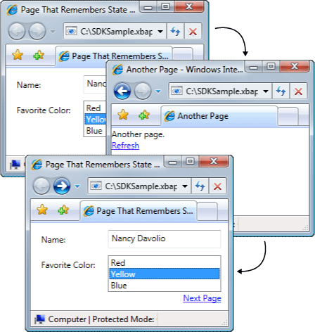  
  
 When a                          <xref:System.Windows.Controls.Page> has controls other than those in the preceding list, or when state is stored in custom objects, you need to write code to cause the journal to remember state across                          <xref:System.Windows.Controls.Page> navigations.  
  
 If you need to remember small pieces of state across                          <xref:System.Windows.Controls.Page> navigations, you can use dependency properties (see                          <xref:System.Windows.DependencyProperty>) that are configured with the                          <xref:System.Windows.FrameworkPropertyMetadata.Journal%2A?displayProperty=fullName> metadata flag.  
  
 If the state that your                          <xref:System.Windows.Controls.Page> needs to remember across navigations comprises multiple pieces of data, you may find it less code intensive to encapsulate your state in a single class and implement the                          <xref:System.Windows.Navigation.IProvideCustomContentState> interface.  
  
 If you need to navigate through various states of a single                          <xref:System.Windows.Controls.Page>, without navigating from the                          <xref:System.Windows.Controls.Page> itself, you can use                          <xref:System.Windows.Navigation.IProvideCustomContentState> and                          <xref:System.Windows.Navigation.NavigationService.AddBackEntry%2A?displayProperty=fullName>.  
  
   
### Cookies  
 Another way that                          [!INCLUDE[TLA2#tla_wpf](../../../../includes/tla2sharptla-wpf-md.md)] applications can store data is with cookies, which are created, updated, and deleted by using the                          <xref:System.Windows.Application.SetCookie%2A> and                          <xref:System.Windows.Application.GetCookie%2A> methods. The cookies that you can create in                          [!INCLUDE[TLA2#tla_wpf](../../../../includes/tla2sharptla-wpf-md.md)] are the same cookies that other types of Web applications use; cookies are arbitrary pieces of data that are stored by an application on a client machine either during or across application sessions. Cookie data typically takes the form of a name/value pair in the following format.  
  
 *Name* `=` *Value*  
  
 When the data is passed to                          <xref:System.Windows.Application.SetCookie%2A>, along with the                          <xref:System.Uri> of the location for which the cookie should be set, a cookie is created in-memory, and it is only available for the duration of the current application session. This type of cookie is referred to as a                          *session cookie*.  
  
 To store a cookie across application sessions, an expiration date must be added to the cookie, using the following format.  
  
 *NAME* `=` *VALUE* `; expires=DAY, DD-MMM-YYYY HH:MM:SS GMT`  
  
 A cookie with an expiration date is stored in the current                          [!INCLUDE[TLA#tla_mswin](../../../../includes/tlasharptla-mswin-md.md)] installation's Temporary Internet Files folder until the cookie expires. Such a cookie is known as a                          *persistent cookie* because it persists across application sessions.  
  
 You retrieve both session and persistent cookies by calling the                          <xref:System.Windows.Application.GetCookie%2A> method, passing the                          <xref:System.Uri> of the location where the cookie was set with the                          <xref:System.Windows.Application.SetCookie%2A> method.  
  
 The following are some of the ways that cookies are supported in                          [!INCLUDE[TLA2#tla_wpf](../../../../includes/tla2sharptla-wpf-md.md)]:  
  
-   [!INCLUDE[TLA2#tla_wpf](../../../../includes/tla2sharptla-wpf-md.md)] standalone applications and                                  [!INCLUDE[TLA2#tla_xbap#plural](../../../../includes/tla2sharptla-xbapsharpplural-md.md)] can both create and manage cookies.  
  
-   Cookies that are created by an                                  [!INCLUDE[TLA2#tla_xbap](../../../../includes/tla2sharptla-xbap-md.md)] can be accessed from the browser.  
  
-   [!INCLUDE[TLA2#tla_xbap#plural](../../../../includes/tla2sharptla-xbapsharpplural-md.md)] from the same domain can create and share cookies.  
  
-   [!INCLUDE[TLA2#tla_xbap#plural](../../../../includes/tla2sharptla-xbapsharpplural-md.md)] and                                  [!INCLUDE[TLA2#tla_html](../../../../includes/tla2sharptla-html-md.md)] pages from the same domain can create and share cookies.  
  
-   Cookies are dispatched when                                  [!INCLUDE[TLA2#tla_xbap#plural](../../../../includes/tla2sharptla-xbapsharpplural-md.md)] and loose                                  [!INCLUDE[TLA2#tla_xaml](../../../../includes/tla2sharptla-xaml-md.md)] pages make Web requests.  
  
-   Both top-level                                  [!INCLUDE[TLA2#tla_xbap#plural](../../../../includes/tla2sharptla-xbapsharpplural-md.md)] and                                  [!INCLUDE[TLA2#tla_xbap#plural](../../../../includes/tla2sharptla-xbapsharpplural-md.md)] hosted in IFRAMES can access cookies.  
  
-   Cookie support in                                  [!INCLUDE[TLA2#tla_wpf](../../../../includes/tla2sharptla-wpf-md.md)] is the same for all supported browsers.  
  
-   In                                  [!INCLUDE[TLA2#tla_ie](../../../../includes/tla2sharptla-ie-md.md)], P3P policy that pertains to cookies is honored by                                  [!INCLUDE[TLA2#tla_wpf](../../../../includes/tla2sharptla-wpf-md.md)], particularly with respect to first-party and third-party                                  [!INCLUDE[TLA2#tla_xbap#plural](../../../../includes/tla2sharptla-xbapsharpplural-md.md)].  
  
   
### Structured Navigation  
 If you need to pass data from one                          <xref:System.Windows.Controls.Page> to another, you can pass the data as arguments to a non-default constructor of the                          <xref:System.Windows.Controls.Page>. Note that if you use this technique, you must keep the                          <xref:System.Windows.Controls.Page> alive; if not, the next time you navigate to the                          <xref:System.Windows.Controls.Page>,                          [!INCLUDE[TLA2#tla_wpf](../../../../includes/tla2sharptla-wpf-md.md)] reinstantiates the                          <xref:System.Windows.Controls.Page> by using the default constructor.  
  
 Alternatively, your                          <xref:System.Windows.Controls.Page> can implement properties that are set with the data that needs to be passed. Things become tricky, however, when a                          <xref:System.Windows.Controls.Page> needs to pass data back to the                          <xref:System.Windows.Controls.Page> that navigated to it. The problem is that navigation doesn't natively support mechanisms for guaranteeing that a                          <xref:System.Windows.Controls.Page> will be returned to after it is navigated from. Essentially, navigation doesn't support call/return semantics. To solve this problem,                          [!INCLUDE[TLA2#tla_wpf](../../../../includes/tla2sharptla-wpf-md.md)] provides the                          <xref:System.Windows.Navigation.PageFunction%601> class that you can use to ensure that a                          <xref:System.Windows.Controls.Page> is returned to in a predictable and structured fashion. For more information, see                          [Structured Navigation Overview](../../../../docs/framework/wpf/app-development/structured-navigation-overview.md).  
  
   
## The NavigationWindow Class  
 To this point, you've seen the gamut of navigation services that you are most likely to use to build applications with navigable content. These services were discussed in the context of                  [!INCLUDE[TLA2#tla_xbap#plural](../../../../includes/tla2sharptla-xbapsharpplural-md.md)], although they are not limited to                  [!INCLUDE[TLA2#tla_xbap#plural](../../../../includes/tla2sharptla-xbapsharpplural-md.md)]. Modern operating systems and                  [!INCLUDE[TLA2#tla_mswin](../../../../includes/tla2sharptla-mswin-md.md)] applications take advantage of the browser experience of modern users to incorporate browser-style navigation into standalone applications. Common examples include:  
  
-   **Word Thesaurus**: Navigate word choices.  
  
-   **File Explorer**: Navigate files and folders.  
  
-   **Wizards**: Breaking down a complex task into multiple pages that can be navigated between. An example is the Windows Components Wizard that handles adding and removing                          [!INCLUDE[TLA2#tla_mswin](../../../../includes/tla2sharptla-mswin-md.md)] features.  
  
 To incorporate browser-style navigation into your standalone applications, you can use the                  <xref:System.Windows.Navigation.NavigationWindow> class.                  <xref:System.Windows.Navigation.NavigationWindow> derives from                  <xref:System.Windows.Window> and extends it with the same support for navigation that                  [!INCLUDE[TLA2#tla_xbap#plural](../../../../includes/tla2sharptla-xbapsharpplural-md.md)] provide. You can use                  <xref:System.Windows.Navigation.NavigationWindow> as either the main window of your standalone application or as a secondary window such as a dialog box.  
  
 To implement a                  <xref:System.Windows.Navigation.NavigationWindow>, as with most top-level classes in                  [!INCLUDE[TLA2#tla_wpf](../../../../includes/tla2sharptla-wpf-md.md)] (                 <xref:System.Windows.Window>,                  <xref:System.Windows.Controls.Page>, and so on), you use a combination of markup and code-behind. This is shown in the following example.  
  
 [!code-xaml[IntroToNavNavigationWindowSnippets#NavigationWindowMARKUP](../../../../samples/snippets/csharp/VS_Snippets_Wpf/IntroToNavNavigationWindowSnippets/CSharp/MainWindow.xaml#navigationwindowmarkup)]  
  
 [!code-csharp[IntroToNavNavigationWindowSnippets#NavigationWindowCODEBEHIND](../../../../samples/snippets/csharp/VS_Snippets_Wpf/IntroToNavNavigationWindowSnippets/CSharp/MainWindow.xaml.cs#navigationwindowcodebehind)]
 [!code-vb[IntroToNavNavigationWindowSnippets#NavigationWindowCODEBEHIND](../../../../samples/snippets/visualbasic/VS_Snippets_Wpf/IntroToNavNavigationWindowSnippets/VisualBasic/MainWindow.xaml.vb#navigationwindowcodebehind)]  
  
 This code creates a                  <xref:System.Windows.Navigation.NavigationWindow> that automatically navigates to a                  <xref:System.Windows.Controls.Page> (HomePage.xaml) when the                  <xref:System.Windows.Navigation.NavigationWindow> is opened. If the                  <xref:System.Windows.Navigation.NavigationWindow> is the main application window, you can use the                  `StartupUri` attribute to launch it. This is shown in the following markup.  
  
 [!code-xaml[IntroToNavNavigationWindowSnippets#AppLaunchNavWindow](../../../../samples/snippets/csharp/VS_Snippets_Wpf/IntroToNavNavigationWindowSnippets/CSharp/App.xaml#applaunchnavwindow)]  
  
 The following figure shows the                  <xref:System.Windows.Navigation.NavigationWindow> as the main window of a standalone application.  
  
   
  
 From the figure, you can see that the                  <xref:System.Windows.Navigation.NavigationWindow> has a title, even though it wasn't set in the                  <xref:System.Windows.Navigation.NavigationWindow> implementation code from the preceding example. Instead, the title is set using the                  <xref:System.Windows.Controls.Page.WindowTitle%2A> property, which is shown in the following code.  
  
 [!code-xaml[IntroToNavNavigationWindowSnippets#HomePageMARKUP1](../../../../samples/snippets/csharp/VS_Snippets_Wpf/IntroToNavNavigationWindowSnippets/CSharp/HomePage.xaml#homepagemarkup1)]  
[!code-xaml[IntroToNavNavigationWindowSnippets#HomePageMARKUP2](../../../../samples/snippets/csharp/VS_Snippets_Wpf/IntroToNavNavigationWindowSnippets/CSharp/HomePage.xaml#homepagemarkup2)]  
  
 Setting the                  <xref:System.Windows.Controls.Page.WindowWidth%2A> and                  <xref:System.Windows.Controls.Page.WindowHeight%2A> properties also affects the                  <xref:System.Windows.Navigation.NavigationWindow>.  
  
 Usually, you implement your own                  <xref:System.Windows.Navigation.NavigationWindow> when you need to customize either its behavior or its appearance. If you do neither, you can use a shortcut. If you specify the pack                  [!INCLUDE[TLA2#tla_uri](../../../../includes/tla2sharptla-uri-md.md)] of a                  <xref:System.Windows.Controls.Page> as the                  <xref:System.Windows.Application.StartupUri%2A> in a standalone application,                  <xref:System.Windows.Application> automatically creates a                  <xref:System.Windows.Navigation.NavigationWindow> to host the                  <xref:System.Windows.Controls.Page>. The following markup shows how to enable this.  
  
 [!code-xaml[IntroToNavNavigationWindowSnippets#AppLaunchPage](../../../../samples/snippets/csharp/VS_Snippets_Wpf/IntroToNavNavigationWindowSnippets/CSharp/AnotherApp.xaml#applaunchpage)]  
  
 If you want a secondary application window such as a dialog box to be a                  <xref:System.Windows.Navigation.NavigationWindow>, you can use the code in the following example to open it.  
  
 [!code-csharp[IntroToNavNavigationWindowSnippets#CreateNWDialogBox](../../../../samples/snippets/csharp/VS_Snippets_Wpf/IntroToNavNavigationWindowSnippets/CSharp/DialogOwnerWindow.xaml.cs#createnwdialogbox)]
 [!code-vb[IntroToNavNavigationWindowSnippets#CreateNWDialogBox](../../../../samples/snippets/visualbasic/VS_Snippets_Wpf/IntroToNavNavigationWindowSnippets/VisualBasic/DialogOwnerWindow.xaml.vb#createnwdialogbox)]  
  
 The following figure shows the result.  
  
 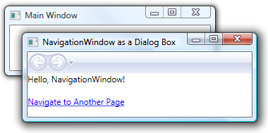  
  
 As you can see,                  <xref:System.Windows.Navigation.NavigationWindow> displays                  [!INCLUDE[TLA2#tla_ie](../../../../includes/tla2sharptla-ie-md.md)]-style                  **Back** and                  **Forward** buttons that allow users to navigate the journal. These buttons provide the same user experience, as shown in the following figure.  
  
 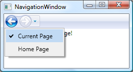  
  
 If your pages provide their own journal navigation support and UI, you can hide the                  **Back** and                  **Forward** buttons displayed by                  <xref:System.Windows.Navigation.NavigationWindow> by setting the value of the                  <xref:System.Windows.Navigation.NavigationWindow.ShowsNavigationUI%2A> property to                  `false`.  
  
 Alternatively, you can use customization support in                  [!INCLUDE[TLA2#tla_wpf](../../../../includes/tla2sharptla-wpf-md.md)] to replace the                  [!INCLUDE[TLA2#tla_ui](../../../../includes/tla2sharptla-ui-md.md)] of the                  <xref:System.Windows.Navigation.NavigationWindow> itself.  
  
   
## The Frame Class  
 Both the browser and                  <xref:System.Windows.Navigation.NavigationWindow> are windows that host navigable content. In some cases, applications have content that does not need to be hosted by an entire window. Instead, such content be hosted inside other content. You can insert navigable content into other content by using the                  <xref:System.Windows.Controls.Frame> class.                  <xref:System.Windows.Controls.Frame> provides the same support as                  <xref:System.Windows.Navigation.NavigationWindow> and                  [!INCLUDE[TLA2#tla_xbap#plural](../../../../includes/tla2sharptla-xbapsharpplural-md.md)].  
  
 The following example shows how to add a                  <xref:System.Windows.Controls.Frame> to a                  <xref:System.Windows.Controls.Page> declaratively by using the                  `Frame` element.  
  
 [!code-xaml[NavigationOverviewSnippets#FrameHostPageXAML1](../../../../samples/snippets/csharp/VS_Snippets_Wpf/NavigationOverviewSnippets/CSharp/FrameHostPage.xaml#framehostpagexaml1)]  
[!code-xaml[NavigationOverviewSnippets#FrameHostPageXAML2](../../../../samples/snippets/csharp/VS_Snippets_Wpf/NavigationOverviewSnippets/CSharp/FrameHostPage.xaml#framehostpagexaml2)]  
[!code-xaml[NavigationOverviewSnippets#FrameHostPageXAML3](../../../../samples/snippets/csharp/VS_Snippets_Wpf/NavigationOverviewSnippets/CSharp/FrameHostPage.xaml#framehostpagexaml3)]  
  
 This markup sets the                  `Source` attribute of the                  `Frame` element with a pack                  [!INCLUDE[TLA2#tla_uri](../../../../includes/tla2sharptla-uri-md.md)] for the                  <xref:System.Windows.Controls.Page> that the                  <xref:System.Windows.Controls.Frame> should initially navigate to. The following figure shows an                  [!INCLUDE[TLA2#tla_xbap](../../../../includes/tla2sharptla-xbap-md.md)] with a                  <xref:System.Windows.Controls.Page> that has a                  <xref:System.Windows.Controls.Frame> that has navigated between several pages.  
  
 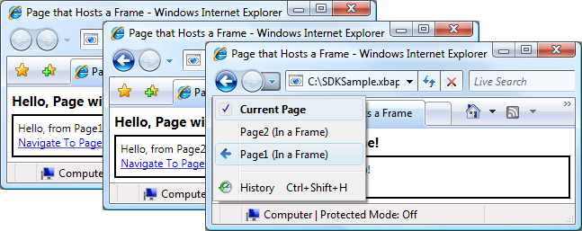  
  
 You don't only have to use                  <xref:System.Windows.Controls.Frame> inside the content of a                  <xref:System.Windows.Controls.Page>. It is also common to host a                  <xref:System.Windows.Controls.Frame> inside the content of a                  <xref:System.Windows.Window>.  
  
 By default,                  <xref:System.Windows.Controls.Frame> only uses its own journal in the absence of another journal. If a                  <xref:System.Windows.Controls.Frame> is part of content that is hosted inside either a                  <xref:System.Windows.Navigation.NavigationWindow> or an                  [!INCLUDE[TLA2#tla_xbap](../../../../includes/tla2sharptla-xbap-md.md)],                  <xref:System.Windows.Controls.Frame> uses the journal that belongs to the                  <xref:System.Windows.Navigation.NavigationWindow> or                  [!INCLUDE[TLA2#tla_xbap](../../../../includes/tla2sharptla-xbap-md.md)]. Sometimes, though, a                  <xref:System.Windows.Controls.Frame> might need to be responsible for its own journal. One reason to do so is to allow journal navigation within the pages that are hosted by a                  <xref:System.Windows.Controls.Frame>. This is illustrated by the following figure.  
  
 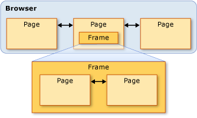  
  
 In this case, you can configure the                  <xref:System.Windows.Controls.Frame> to use its own journal by setting the                  <xref:System.Windows.Controls.Frame.JournalOwnership%2A> property of the                  <xref:System.Windows.Controls.Frame> to                  <xref:System.Windows.Navigation.JournalOwnership.OwnsJournal>. This is shown in the following markup.  
  
 [!code-xaml[NavigationOverviewSnippets#FrameHostPageOwnJournalXAML1](../../../../samples/snippets/csharp/VS_Snippets_Wpf/NavigationOverviewSnippets/CSharp/FrameHostPageOwnJournal.xaml#framehostpageownjournalxaml1)]  
[!code-xaml[NavigationOverviewSnippets#FrameHostPageOwnJournalXAML2](../../../../samples/snippets/csharp/VS_Snippets_Wpf/NavigationOverviewSnippets/CSharp/FrameHostPageOwnJournal.xaml#framehostpageownjournalxaml2)]  
[!code-xaml[NavigationOverviewSnippets#FrameHostPageOwnJournalXAML3](../../../../samples/snippets/csharp/VS_Snippets_Wpf/NavigationOverviewSnippets/CSharp/FrameHostPageOwnJournal.xaml#framehostpageownjournalxaml3)]  
  
 The following figure illustrates the effect of navigating within a                  <xref:System.Windows.Controls.Frame> that uses its own journal.  
  
 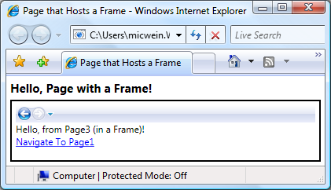  
  
 Notice that the journal entries are shown by the navigation                  [!INCLUDE[TLA2#tla_ui](../../../../includes/tla2sharptla-ui-md.md)] in the                  <xref:System.Windows.Controls.Frame>, rather than by                  [!INCLUDE[TLA2#tla_ie](../../../../includes/tla2sharptla-ie-md.md)].  
  
> [!NOTE]
>  If a                      <xref:System.Windows.Controls.Frame> is part of content that is hosted in a                      <xref:System.Windows.Window>,                      <xref:System.Windows.Controls.Frame> uses its own journal and, consequently, displays its own navigation                      [!INCLUDE[TLA2#tla_ui](../../../../includes/tla2sharptla-ui-md.md)].  
  
 If your user experience requires a                  <xref:System.Windows.Controls.Frame> to provide its own journal without showing the navigation                  [!INCLUDE[TLA2#tla_ui](../../../../includes/tla2sharptla-ui-md.md)], you can hide the navigation                  [!INCLUDE[TLA2#tla_ui](../../../../includes/tla2sharptla-ui-md.md)] by setting the                  <xref:System.Windows.Controls.Frame.NavigationUIVisibility%2A> to                  <xref:System.Windows.Visibility.Hidden>. This is shown in the following markup.  
  
 [!code-xaml[NavigationOverviewSnippets#FrameHostPageHidesUIXAML1](../../../../samples/snippets/csharp/VS_Snippets_Wpf/NavigationOverviewSnippets/CSharp/FrameHostPageOwnHiddenJournal.xaml#framehostpagehidesuixaml1)]  
[!code-xaml[NavigationOverviewSnippets#FrameHostPageHidesUIXAML2](../../../../samples/snippets/csharp/VS_Snippets_Wpf/NavigationOverviewSnippets/CSharp/FrameHostPageOwnHiddenJournal.xaml#framehostpagehidesuixaml2)]  
[!code-xaml[NavigationOverviewSnippets#FrameHostPageHidesUIXAML3](../../../../samples/snippets/csharp/VS_Snippets_Wpf/NavigationOverviewSnippets/CSharp/FrameHostPageOwnHiddenJournal.xaml#framehostpagehidesuixaml3)]  
  
   
## Navigation Hosts  
 <xref:System.Windows.Controls.Frame> and                  <xref:System.Windows.Navigation.NavigationWindow> are classes that are known as navigation hosts. A                  *navigation host* is a class that can navigate to and display content. To accomplish this, each navigation host uses its own                  <xref:System.Windows.Navigation.NavigationService> and journal. The basic construction of a navigation host is shown in the following figure.  
  
 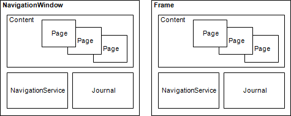  
  
 Essentially, this allows                  <xref:System.Windows.Navigation.NavigationWindow> and                  <xref:System.Windows.Controls.Frame> to provide the same navigation support that an                  [!INCLUDE[TLA2#tla_xbap](../../../../includes/tla2sharptla-xbap-md.md)] provides when hosted in the browser.  
  
 Besides using                  <xref:System.Windows.Navigation.NavigationService> and a journal, navigation hosts implement the same members that                  <xref:System.Windows.Navigation.NavigationService> implements. This is illustrated by the following figure.  
  
 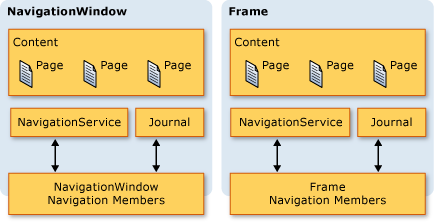  
  
 This allows you to program navigation support directly against them. You may consider this if you need to provide a custom navigation                  [!INCLUDE[TLA2#tla_ui](../../../../includes/tla2sharptla-ui-md.md)] for a                  <xref:System.Windows.Controls.Frame> that is hosted in a                  <xref:System.Windows.Window>. Furthermore, both types implement additional, navigation-related members, including                  `BackStack` (                 <xref:System.Windows.Navigation.NavigationWindow.BackStack%2A?displayProperty=fullName>,                  <xref:System.Windows.Controls.Frame.BackStack%2A?displayProperty=fullName>) and                  `ForwardStack` (                 <xref:System.Windows.Navigation.NavigationWindow.ForwardStack%2A?displayProperty=fullName>,                  <xref:System.Windows.Controls.Frame.ForwardStack%2A?displayProperty=fullName>), which allow you to enumerate the journal entries in the back stack and forward stack, respectively.  
  
 As mentioned earlier, more than one journal can exist within an application. The following figure provides an example of when this can happen.  
  
 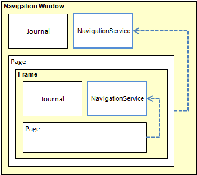  
  
   
## Navigating to Content Other than XAML Pages  
 Throughout this topic,                  <xref:System.Windows.Controls.Page> and pack                  [!INCLUDE[TLA2#tla_xbap#plural](../../../../includes/tla2sharptla-xbapsharpplural-md.md)] have been used to demonstrate the various navigation capabilities of                  [!INCLUDE[TLA2#tla_wpf](../../../../includes/tla2sharptla-wpf-md.md)]. However, a                  <xref:System.Windows.Controls.Page> that is compiled into an application is not the only type of content that can be navigated to, and pack                  [!INCLUDE[TLA2#tla_xbap#plural](../../../../includes/tla2sharptla-xbapsharpplural-md.md)] aren't the only way to identify content.  
  
 As this section demonstrates, you can also navigate to loose                  [!INCLUDE[TLA2#tla_xaml](../../../../includes/tla2sharptla-xaml-md.md)] files,                  [!INCLUDE[TLA2#tla_html](../../../../includes/tla2sharptla-html-md.md)] files, and objects.  
  
   
### Navigating to Loose XAML Files  
 A loose                          [!INCLUDE[TLA2#tla_xaml](../../../../includes/tla2sharptla-xaml-md.md)] file is a file with the following characteristics:  
  
-   Contains only                                  [!INCLUDE[TLA2#tla_xaml](../../../../includes/tla2sharptla-xaml-md.md)] (that is, no code).  
  
-   Has an appropriate namespace declaration.  
  
-   Has the .xaml file name extension.  
  
 For example, consider the following content that is stored as a loose                          [!INCLUDE[TLA2#tla_xaml](../../../../includes/tla2sharptla-xaml-md.md)] file, Person.xaml.  
  
 [!code-xaml[NavigationOverviewSnippets#LooseXAML](../../../../samples/snippets/csharp/VS_Snippets_Wpf/NavigationOverviewSnippets/CSharp/Person.xaml#loosexaml)]  
  
 When you double-click the file, the browser opens and navigates to and displays the content. This is shown in the following figure.  
  
 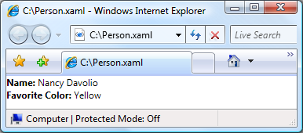  
  
 You can display a loose                          [!INCLUDE[TLA2#tla_xaml](../../../../includes/tla2sharptla-xaml-md.md)] file from the following:  
  
-   A Web site on the local machine, the intranet, or the Internet.  
  
-   A                                  [!INCLUDE[TLA#tla_unc](../../../../includes/tlasharptla-unc-md.md)] file share.  
  
-   The local disk.  
  
 A loose                          [!INCLUDE[TLA2#tla_xaml](../../../../includes/tla2sharptla-xaml-md.md)] file can be added to the browser's favorites, or be the browser's home page.  
  
> [!NOTE]
>  For more information about publishing and launching loose                              [!INCLUDE[TLA2#tla_xaml](../../../../includes/tla2sharptla-xaml-md.md)] pages, see                              [Deploying a WPF Application](../../../../docs/framework/wpf/app-development/deploying-a-wpf-application-wpf.md).  
  
 One limitation with respect to loose                          [!INCLUDE[TLA2#tla_xaml](../../../../includes/tla2sharptla-xaml-md.md)] is that you can only host content that is safe to run in partial trust. For example,                          `Window` cannot be the root element of a loose                          [!INCLUDE[TLA2#tla_xaml](../../../../includes/tla2sharptla-xaml-md.md)] file. For more information, see                          [WPF Partial Trust Security](../../../../docs/framework/wpf/wpf-partial-trust-security.md).  
  
   
### Navigating to HTML Files by Using Frame  
 As you might expect, you can also navigate to                          [!INCLUDE[TLA2#tla_html](../../../../includes/tla2sharptla-html-md.md)]. You simply need to provide a                          [!INCLUDE[TLA2#tla_uri](../../../../includes/tla2sharptla-uri-md.md)] that uses the http scheme. For example, the following                          [!INCLUDE[TLA2#tla_xaml](../../../../includes/tla2sharptla-xaml-md.md)] shows a                          <xref:System.Windows.Controls.Frame> that navigates to an                          [!INCLUDE[TLA2#tla_html](../../../../includes/tla2sharptla-html-md.md)] page.  
  
 [!code-xaml[NavigationOverviewSnippets#FrameHtmlNavMARKUP](../../../../samples/snippets/csharp/VS_Snippets_Wpf/NavigationOverviewSnippets/CSharp/FrameHTMLNavPage.xaml#framehtmlnavmarkup)]  
  
 Navigating to                          [!INCLUDE[TLA2#tla_html](../../../../includes/tla2sharptla-html-md.md)] requires special permissions. For example, you can't navigate from an                          [!INCLUDE[TLA2#tla_xbap](../../../../includes/tla2sharptla-xbap-md.md)] that is running in the Internet zone partial trust security sandbox. For more information, see                          [WPF Partial Trust Security](../../../../docs/framework/wpf/wpf-partial-trust-security.md).  
  
   
### Navigating to HTML Files by Using the WebBrowser Control  
 The                          <xref:System.Windows.Controls.WebBrowser> control supports                          [!INCLUDE[TLA2#tla_html](../../../../includes/tla2sharptla-html-md.md)] document hosting, navigation and script/managed code interoperability. For detailed information regarding the                          <xref:System.Windows.Controls.WebBrowser> control, see                          <xref:System.Windows.Controls.WebBrowser>.  
  
 Like                          <xref:System.Windows.Controls.Frame>, navigating to                          [!INCLUDE[TLA2#tla_html](../../../../includes/tla2sharptla-html-md.md)] using                          <xref:System.Windows.Controls.WebBrowser> requires special permissions. For example, from a partial-trust application, you can navigate only to                          [!INCLUDE[TLA2#tla_html](../../../../includes/tla2sharptla-html-md.md)] located at the site of origin. For more information, see                          [WPF Partial Trust Security](../../../../docs/framework/wpf/wpf-partial-trust-security.md).  
  
   
### Navigating to Custom Objects  
 If you have data that is stored as custom objects, one way to display that data is to create a                          <xref:System.Windows.Controls.Page> with content that is bound to those objects (see                          [Data Binding Overview](../../../../docs/framework/wpf/data/data-binding-overview.md)). If you don't need the overhead of creating an entire page just to display the objects, you can navigate directly to them instead.  
  
 Consider the                          `Person` class that is implemented in the following code.  
  
 [!code-csharp[NavigateToObjectSnippets#PersonClassCODE](../../../../samples/snippets/csharp/VS_Snippets_Wpf/NavigateToObjectSnippets/CSharp/Person.cs#personclasscode)]
 [!code-vb[NavigateToObjectSnippets#PersonClassCODE](../../../../samples/snippets/visualbasic/VS_Snippets_Wpf/NavigateToObjectSnippets/VisualBasic/Person.vb#personclasscode)]  
  
 To navigate to it, you call the                          <xref:System.Windows.Navigation.NavigationWindow.Navigate%2A?displayProperty=fullName> method, as demonstrated by the following code.  
  
 [!code-xaml[NavigateToObjectSnippets#PageThatNavsToObject1](../../../../samples/snippets/csharp/VS_Snippets_Wpf/NavigateToObjectSnippets/CSharp/HomePage.xaml#pagethatnavstoobject1)]  
[!code-xaml[NavigateToObjectSnippets#PageThatNavsToObject2](../../../../samples/snippets/csharp/VS_Snippets_Wpf/NavigateToObjectSnippets/CSharp/HomePage.xaml#pagethatnavstoobject2)]  
[!code-xaml[NavigateToObjectSnippets#PageThatNavsToObject3](../../../../samples/snippets/csharp/VS_Snippets_Wpf/NavigateToObjectSnippets/CSharp/HomePage.xaml#pagethatnavstoobject3)]  
  
 [!code-csharp[NavigateToObjectSnippets#PageThatNavsToObjectCODEBEHIND](../../../../samples/snippets/csharp/VS_Snippets_Wpf/NavigateToObjectSnippets/CSharp/HomePage.xaml.cs#pagethatnavstoobjectcodebehind)]
 [!code-vb[NavigateToObjectSnippets#PageThatNavsToObjectCODEBEHIND](../../../../samples/snippets/visualbasic/VS_Snippets_Wpf/NavigateToObjectSnippets/VisualBasic/HomePage.xaml.vb#pagethatnavstoobjectcodebehind)]  
  
 The following figure shows the result.  
  
   
  
 From this figure, you can see that nothing useful is displayed. In fact, the value that is displayed is the return value of the                          `ToString` method for the                          **Person** object; by default, this is the only value that                          [!INCLUDE[TLA2#tla_wpf](../../../../includes/tla2sharptla-wpf-md.md)] can use to represent your object. You could override the                          `ToString` method to return more meaningful information, although it will still only be a string value. One technique you can use that takes advantage of the presentation capabilities of                          [!INCLUDE[TLA2#tla_wpf](../../../../includes/tla2sharptla-wpf-md.md)] is to use a data template. You can implement a data template that                          [!INCLUDE[TLA2#tla_wpf](../../../../includes/tla2sharptla-wpf-md.md)] can associate with an object of a particular type. The following code shows a data template for the                          `Person` object.  
  
 [!code-xaml[NavigateToObjectSnippets#DataTemplateMARKUP](../../../../samples/snippets/csharp/VS_Snippets_Wpf/NavigateToObjectSnippets/CSharp/App.xaml#datatemplatemarkup)]  
  
 Here, the data template is associated with the                          `Person` type by using the                          `x:Type` markup extension in the                          `DataType` attribute. The data template then binds                          `TextBlock` elements (see                          <xref:System.Windows.Controls.TextBlock>) to the properties of the                          `Person` class. The following figure shows the updated appearance of the                          `Person` object.  
  
 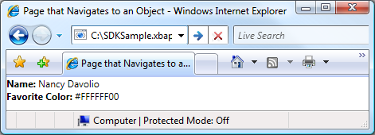  
  
 An advantage of this technique is the consistency you gain by being able to reuse the data template to display your objects consistently anywhere in your application.  
  
 For more information on data templates, see                          [Data Templating Overview](../../../../docs/framework/wpf/data/data-templating-overview.md).  
  
   
## Security  
 [!INCLUDE[TLA2#tla_wpf](../../../../includes/tla2sharptla-wpf-md.md)] navigation support allows                  [!INCLUDE[TLA2#tla_xbap#plural](../../../../includes/tla2sharptla-xbapsharpplural-md.md)] to be navigated to across the Internet, and it allows applications to host third-party content. To protect both applications and users from harmful behavior,                  [!INCLUDE[TLA2#tla_wpf](../../../../includes/tla2sharptla-wpf-md.md)] provides a variety of security features that are discussed in                  [Security](../../../../docs/framework/wpf/security-wpf.md) and                  [WPF Partial Trust Security](../../../../docs/framework/wpf/wpf-partial-trust-security.md).  
  
## See Also  
 <xref:System.Windows.Application.SetCookie%2A>   
 <xref:System.Windows.Application.GetCookie%2A>   
 [Application Management Overview](../../../../docs/framework/wpf/app-development/application-management-overview.md)   
 [Pack URIs in WPF](../../../../docs/framework/wpf/app-development/pack-uris-in-wpf.md)   
 [Structured Navigation Overview](../../../../docs/framework/wpf/app-development/structured-navigation-overview.md)   
 [Navigation Topologies Overview](../../../../docs/framework/wpf/app-development/navigation-topologies-overview.md)   
 [How-to Topics](../../../../docs/framework/wpf/app-development/navigation-how-to-topics.md)   
 [Deploying a WPF Application](../../../../docs/framework/wpf/app-development/deploying-a-wpf-application-wpf.md)
