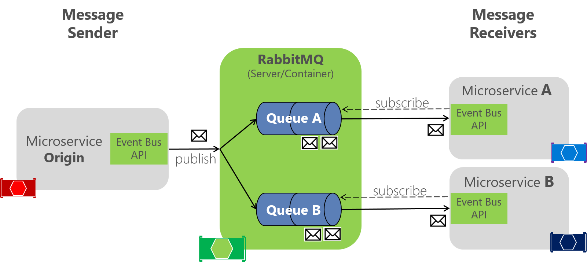

# Implementing an event bus with RabbitMQ for the development or test environment

We should start by saying that if you create your custom event bus based on RabbitMQ running in a container, as the eShopOnContainers application does, it should be used only for your development and test environments. You should not use it for your production environment, unless you are building it as a part of a production-ready service bus. A simple custom event bus might be missing many production-ready critical features that a commercial service bus has.

The eShopOnContainers custom implementation of an event bus is basically a library using the RabbitMQ API. The implementation lets microservices subscribe to events, publish events, and receive events, as shown in Figure 8-21.



**Figure 8-21.** RabbitMQ implementation of an event bus

In the code, the EventBusRabbitMQ class implements the generic IEventBus interface. This is based on Dependency Injection so that you can swap from this dev/test version to a production version.

```csharp
public class EventBusRabbitMQ : IEventBus, IDisposable
{
    // Implementation using RabbitMQ API
    //...
```

The RabbitMQ implementation of a sample dev/test event bus is boilerplate code. It has to handle the connection to the RabbitMQ server and provide code for publishing a message event to the queues. It also has to implement a dictionary of collections of integration event handlers for each event type; these event types can have a different instantiation and different subscriptions for each receiver microservice, as shown in Figure 8-21.

## Implementing a simple publish method with RabbitMQ

The following code is part of the eShopOnContainers event bus implementation for RabbitMQ, so you usually do not need to code it unless you are making improvements. The code gets a connection and channel to RabbitMQ, creates a message, and then publishes the message into the queue.

```csharp
public class EventBusRabbitMQ : IEventBus, IDisposable
{
    // Member objects and other methods ...
    // ...

    public void Publish(IntegrationEvent @event)
    {
        var eventName = @event.GetType().Name;
        var factory = new ConnectionFactory() { HostName = _connectionString };
        using (var connection = factory.CreateConnection())
        using (var channel = connection.CreateModel())
        {
            channel.ExchangeDeclare(exchange: _brokerName,
                type: "direct");
            string message = JsonConvert.SerializeObject(@event);
            var body = Encoding.UTF8.GetBytes(message);
            channel.BasicPublish(exchange: _brokerName,
                routingKey: eventName,
                basicProperties: null,
                body: body);
       }
    }
}
```

The [actual code](https://github.com/dotnet-architecture/eShopOnContainers/blob/master/src/BuildingBlocks/EventBus/EventBusRabbitMQ/EventBusRabbitMQ.cs) of the Publish method in the eShopOnContainers application is improved by using a [Polly](https://github.com/App-vNext/Polly) retry policy, which retries the task a certain number of times in case the RabbitMQ container is not ready. This can occur when docker-compose is starting the containers; for example, the RabbitMQ container might start more slowly than the other containers.

As mentioned earlier, there are many possible configurations in RabbitMQ, so this code should be used only for dev/test environments.

## Implementing the subscription code with the RabbitMQ API

As with the publish code, the following code is a simplification of part of the event bus implementation for RabbitMQ. Again, you usually do not need to change it unless you are improving it.

```csharp
public class EventBusRabbitMQ : IEventBus, IDisposable
{
    // Member objects and other methods ...
    // ...
    public void Subscribe<T>(IIntegrationEventHandler<T> handler)
        where T : IntegrationEvent
    {
        var eventName = typeof(T).Name;
        if (_handlers.ContainsKey(eventName))
        {
            _handlers[eventName].Add(handler);
        }
        else
        {
            var channel = GetChannel();
            channel.QueueBind(queue: _queueName,
                exchange: _brokerName,
                routingKey: eventName);
            _handlers.Add(eventName, new List<IIntegrationEventHandler>());
            _handlers[eventName].Add(handler);
            _eventTypes.Add(typeof(T));
        }
    }
}
```

Each event type has a related channel to get events from RabbitMQ. You can then have as many event handlers per channel and event type as needed.

The Subscribe method accepts an IIntegrationEventHandler object, which is like a callback method in the current microservice, plus its related IntegrationEvent object. The code then adds that event handler to the list of event handlers that each integration event type can have per client microservice. If the client code has not already been subscribed to the event, the code creates a channel for the event type so it can receive events in a push style from RabbitMQ when that event is published from any other service.


>[!div class="step-by-step"]
[Previous] (integration-event-based-microservice-communications.md)
[Next] (subscribe-events.md)
